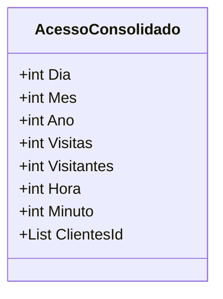

# AcessoConsolidado
**Namespace**: IsthmusWinthor.Dominio.Analytics.Acessos  
**Nome do Arquivo**: AcessoConsolidado.cs  

## Visão Geral e Responsabilidade
A classe `AcessoConsolidado` atua como um modelo de domínio que representa dados consolidados de acessos a um sistema. O objetivo principal é fornecer uma estrutura que consolida informações relevantes sobre visitas e visitantes ao longo de períodos específicos, como dia, hora ou mês, conforme o tipo de relatório solicitado. Essa classe permite a agregação e análise de dados de acessos, facilitando a compreensão do comportamento dos usuários em relação ao sistema.

## Métodos de Negócio
Não existem métodos com lógica de negócio na classe `AcessoConsolidado`; esta classe serve essencialmente como um container para transportação de dados.

## Propriedades Calculadas e de Validação
- Não há propriedades que contenham lógica no `get` ou validação no `set`.

## Navigations Property
- Não há propriedades que sejam classes complexas do domínio.

## Tipos Auxiliares e Dependências
- Nenhum tipo auxiliar como enumeradores (Enums) ou classes estáticas/helpers estão sendo utilizados nesta classe.

## Diagrama de Relacionamentos

---
Gerada em 29/12/2025 20:06:34
