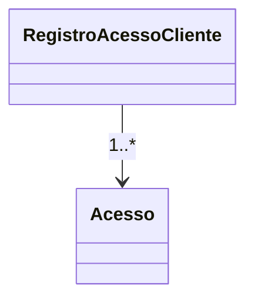

# RegistroAcessoCliente

**Namespace**: IsthmusWinthor.Dominio.Analytics.Acessos  
**Nome do Arquivo**: RegistroAcessoCliente.cs  

## Visão Geral e Responsabilidade
A classe `RegistroAcessoCliente` desempenha o papel de agregar e manipular dados relacionados a registros de acesso de clientes em um dia específico. Ela fornece funcionalidades para calcular o total de acessos e logins a partir de uma lista de acessos, permitindo a análise de padrões de acesso ao sistema por parte dos usuários.

## Métodos de Negócio

### TotalAcessos (Público)
- **Objetivo**: Fornecer o total de acessos registrados para o cliente.
- **Comportamento**: Conta todas as entradas na lista de `Acessos`.
- **Retorno**: Número inteiro representando o total de acessos.

### TotalLogins (Público)
- **Objetivo**: Determinar quantas vezes a página de autenticação foi acessada.
- **Comportamento**:
  1. Filtra a lista de `Acessos` para obter apenas aqueles cujo `UrlPagina` é "AUTENTICACAO" (insensível a maiúsculas).
  2. Conta o número de ocorrências que atendem a esse critério.
- **Retorno**: Número inteiro indicando quantas vezes a autenticação foi acessada.

```mermaid
flowchart TD
    A[Início] --> B{Lista de Acessos}
    B -->|Filtrar por "AUTENTICACAO"| C[Somente 'AUTENTICACAO']
    C --> D[Fim: Contagem de Logins]
```

## Propriedades Calculadas e de Validação
Nenhuma propriedade possui lógica no `get` ou validações específicas no `set`.

## Navigations Property
Nenhuma propriedade atua como uma ligação complexa do domínio nesta classe.

## Tipos Auxiliares e Dependências
- [Acesso](Acesso.md): Utilizado para representar dados individuais de acesso dentro de `RegistroAcessoCliente`.

## Diagrama de Relacionamentos

