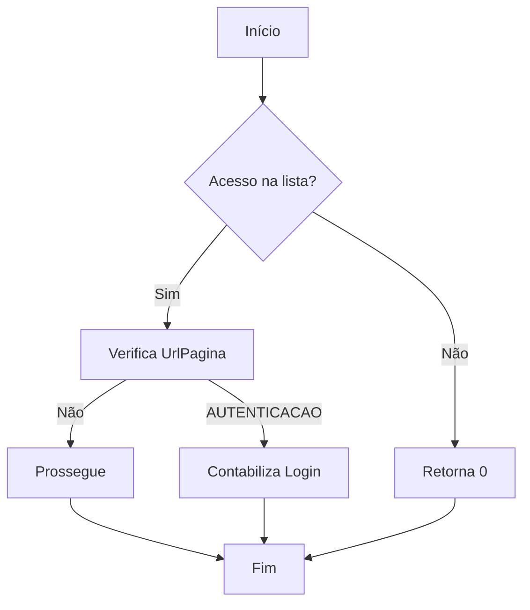
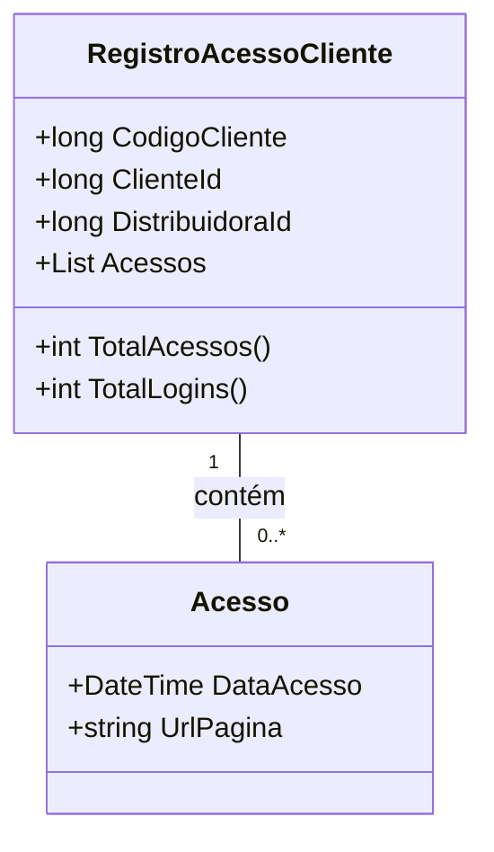

# RegistroAcessoCliente
**Namespace**: IsthmusWinthor.Dominio.Analytics.Acessos  
**Nome do Arquivo**: RegistroAcessoCliente.cs  

## Visão Geral e Responsabilidade
A classe `RegistroAcessoCliente` representa um registro de acessos diários de um cliente. Seu papel é centralizar informações sobre as interações do cliente com o sistema, permitindo o controle e a análise de comportamentos de acesso, como o total de acessos e logins. Essa estrutura auxilia na identificação de padrões de uso e na tomada de decisões estratégicas com base no comportamento do cliente.

## Métodos de Negócio

### TotalAcessos
- **Visibilidade**: Público
- **Objetivo**: Retornar o total de acessos registrados para o cliente no dia.
- **Comportamento**: 
  - O método verifica a lista `Acessos`.
  - Conta a quantidade de elementos presentes nesta lista.
- **Retorno**: Um inteiro que representa o número total de acessos do cliente.

### TotalLogins
- **Visibilidade**: Público
- **Objetivo**: Calcular o total de logins realizados pelo cliente durante o dia.
- **Comportamento**: 
  - O método filtra a lista `Acessos`, buscando aqueles cuja `UrlPagina` é igual a "AUTENTICACAO" (comparando sem diferenças de maiúsculas ou minúsculas).
  - Conta quantos elementos atendem a essa condição.
- **Retorno**: Um inteiro que representa o número total de logins do cliente.

## Propriedades Calculadas e de Validação
N/A

## Navigations Property
- Acessos: `List<Acesso>` - Representa uma coleção dos acessos feitos pelo cliente, cada um com data e URL correspondente.

#### [Acesso](Acesso.md)

## Tipos Auxiliares e Dependências
N/A

## Diagrama de Relacionamentos

---
Gerada em 29/12/2025 20:06:54
