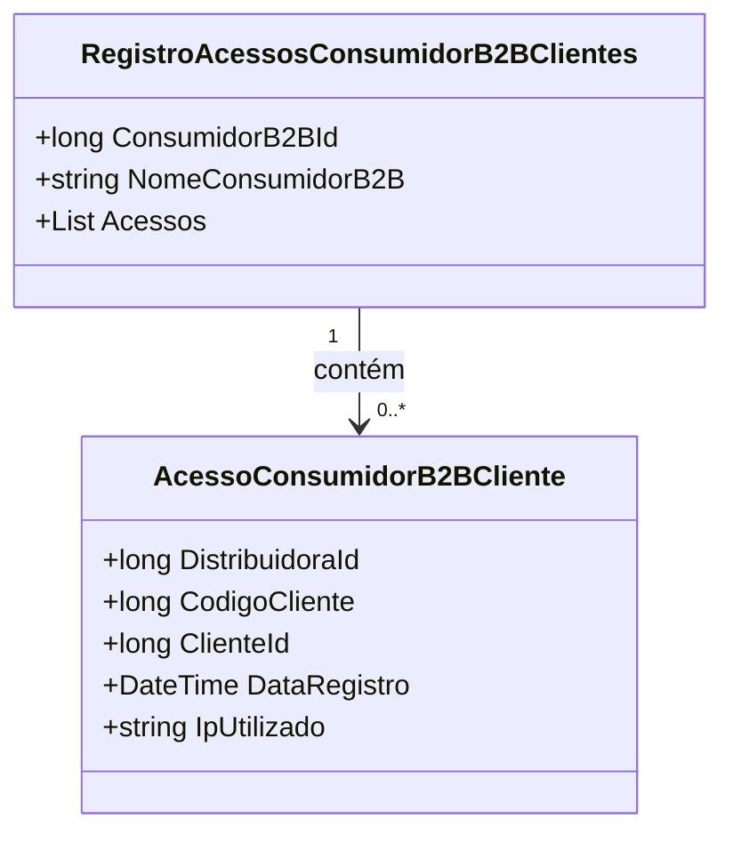

# RegistroAcessosConsumidorB2BClientes
**Namespace**: IsthmusWinthor.Dominio.Analytics.AutorizacoesClientes  
**Nome do Arquivo**: RegistroAcessosConsumidorB2BClientes.cs  

## Visão Geral e Responsabilidade
A classe `RegistroAcessosConsumidorB2BClientes` representa um modelo de domínio que encapsula informações sobre os acessos realizados por clientes de um consumidor B2B. Este modelo é responsável por agrupar os acessos realizados por um consumidor específico, permitindo o rastreamento de atividades e o gerenciamento de permissões que facilitam a auditoria e a análise de consumo.

## Métodos de Negócio
Não há métodos com lógica de negócios a serem documentados nesta classe, pois ela serve principalmente como um contêiner de dados.

## Propriedades Calculadas e de Validação
Não há propriedades com lógica de cálculo ou validação específica nesta classe.

## Navigations Property
- `Acessos`: Referencia a uma lista de [AcessoConsumidorB2BCliente](AcessoConsumidorB2BCliente.md), que contém detalhes sobre cada acesso individual.

## Tipos Auxiliares e Dependências
Nenhum tipo auxiliar, enumerador ou classe estática auxiliar é utilizado diretamente por esta classe.

## Diagrama de Relacionamentos

---
Gerada em 29/12/2025 20:07:06
