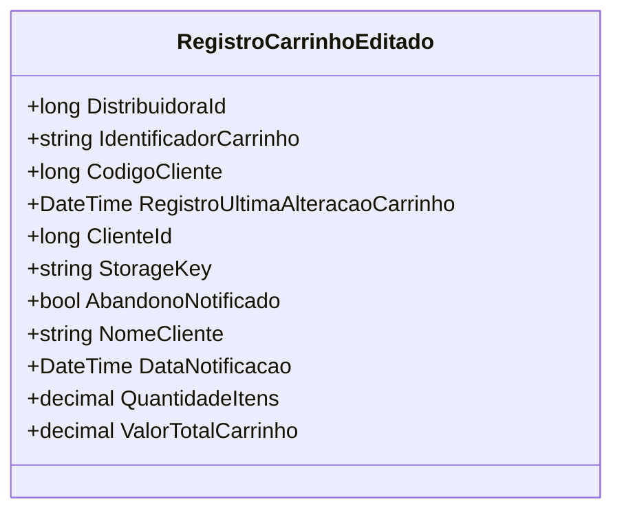

# RegistroCarrinhoEditado
**Namespace**: IsthmusWinthor.Dominio.Analytics.CarrinhoCompras  
**Nome do Arquivo**: RegistroCarrinhoEditado.cs  

O `RegistroCarrinhoEditado` é uma classe que transporta dados relacionados a alterações feitas em um carrinho de compras. Ela é usada para registrar informações relevantes que devem ser enviadas para o sistema de fila para processamento posterior, garantindo que a alteração no carrinho seja tratada adequadamente.

### Métodos de Negócio
Não há métodos com lógica de negócios implementados nesta classe. Todos os métodos presentes consistem em simples getters e setters.

### Propriedades Calculadas e de Validação
Não existem propriedades na classe que implementem lógica de cálculo em seus acessadores ou validação em seus modificadores.

### Navigation Property
Não há propriedades que sejam classes complexas do domínio a serem referenciadas.

### Tipos Auxiliares e Dependências
Não existem enumeradores ou classes estáticas/helpers diretamente utilizadas por esta classe.

### Diagrama de Relacionamentos

---
Gerada em 29/12/2025 20:07:17
