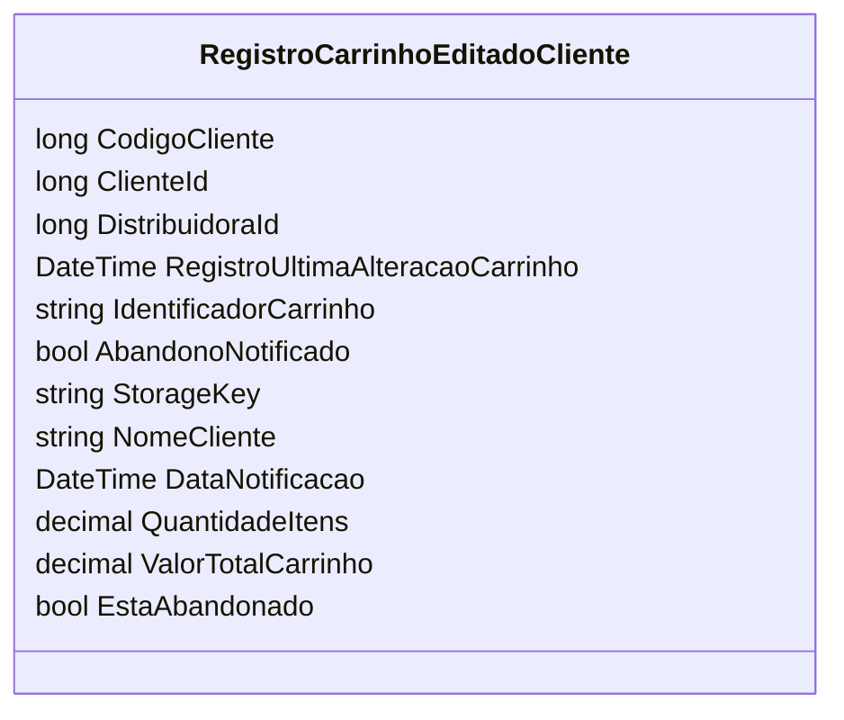

# RegistroCarrinhoEditadoCliente
**Namespace**: IsthmusWinthor.Dominio.Analytics.CarrinhoCompras  
**Nome do Arquivo**: RegistroCarrinhoEditadoCliente.cs  

## Visão Geral e Responsabilidade
A classe `RegistroCarrinhoEditadoCliente` atua como um registro que mantém informações sobre as alterações realizadas no carrinho de compras de um cliente. Este mecanismo é fundamental para o monitoramento de abandonos de carrinho e para a notificação apropriada ao cliente, facilitando intervenções que visem a recuperação de vendas potenciais.

## Métodos de Negócio
- **Título**: Não há métodos de negócio definidos nesta classe.  
  A classe consiste apenas em propriedades anêmicas sem lógica de negócio implementada.

## Propriedades Calculadas e de Validação
- **Nenhuma propriedade calculada ou com validação apresentada.**  
  Todas as propriedades são simples e estão diretamente relacionadas à captura de dados.

## Navigation Property
- **Nenhuma Navigation Property definida.**  
  A classe atua como um simples registro de informações sem referências a classes complexas do domínio.

## Tipos Auxiliares e Dependências
- **Nenhum tipo auxiliar, enumeração ou classe helper utilizada.**  
  A classe não depende de outros componentes externos para sua definição.

## Diagrama de Relacionamentos

### Conclusão
A classe `RegistroCarrinhoEditadoCliente` serve como um modelo de dados simples, sem lógica de negócio adicional, permitindo a coleta e manipulação de dados associados ao comportamento do cliente em relação ao carrinho de compras.
---
Gerada em 29/12/2025 20:07:30
