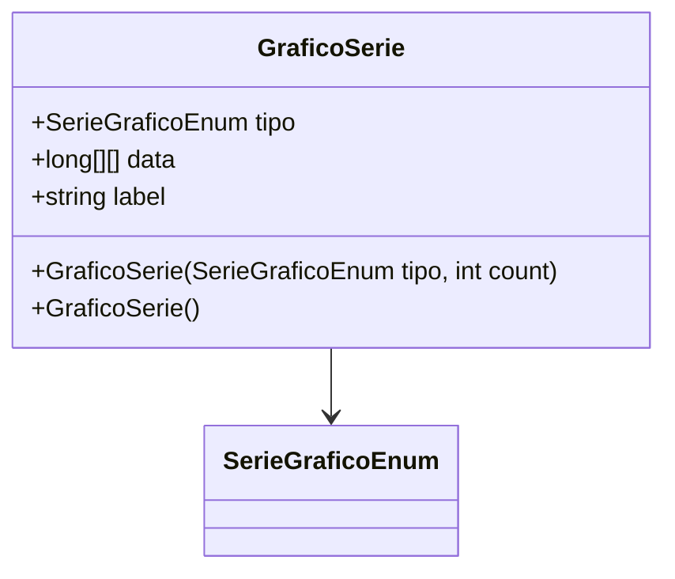

# GraficoSerie
**Namespace**: IsthmusWinthor.Dominio.Analytics.Graficos  
**Nome do Arquivo**: GraficoSerie.cs  

## Visão Geral e Responsabilidade
A classe `GraficoSerie` representa uma série de dados para gráficos em um sistema de análise. Sua principal responsabilidade é encapsular informações sobre o tipo de gráfico, associá-las a um label descritivo e armazenar um conjunto de dados estruturados para visualização. Isso resolve o problema de organizar e manipular dados que serão utilizados em representações gráficas, permitindo uma análise mais eficiente.

## Métodos de Negócio

### 1. Título: label (get)
- **Objetivo**: Fornecer uma descrição legível do tipo de gráfico.
- **Comportamento**: O método utiliza a função `Description()` do tipo `SerieGraficoEnum` para retornar uma string que representa o rótulo do gráfico com base em seu tipo correspondente.
- **Retorno**: Retorna uma string que descreve o tipo de gráfico.

## Propriedades Calculadas e de Validação
- **label**: Esta propriedade realiza uma chamada a um método de descrição para o enum `SerieGraficoEnum`, garantindo que a representação textual do tipo de gráfico seja sempre adequada e legível.

## Navigations Property
- Nenhuma propriedade da classe `GraficoSerie` representa classes complexas do domínio.

## Tipos Auxiliares e Dependências
- **Enumeradores**:
  - [SerieGraficoEnum](SerieGraficoEnum.md): Utilizado para definir o tipo de gráfico da série.

## Diagrama de Relacionamentos

---
Gerada em 29/12/2025 20:07:40
