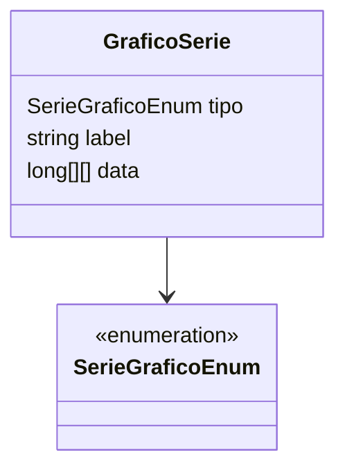

# GraficoSerie

**Namespace**: IsthmusWinthor.Dominio.Analytics.Graficos  
**Nome do Arquivo**: GraficoSerie.cs

> A classe `GraficoSerie` é um Rich Domain Model responsável pela representação de séries para gráficos analíticos no sistema. Ela gerencia a lógica relacionada às séries de dados e seus tipos, facilitando a criação de representações visuais de dados analíticos.

## Visão Geral e Responsabilidade
A classe `GraficoSerie` atua como um componente central no sistema de visualização de dados, contribuindo para o processamento e exibição de gráficos analíticos. Ela permite a construção de séries de dados a partir de informações brutas, categorizadas por tipo e rotuladas de acordo. A classe é projetada para suportar diferentes tipos de séries definidas pelo sistema e fornece infraestrutura para manipulação e exibição eficaz de dados gráficos, essencial para a interpretação e análise de métricas de negócio.

## Métodos de Negócio

### Construtor Rico: `GraficoSerie(SerieGraficoEnum tipo, int count)`
- **Objetivo**: Inicializa uma nova instância da série de gráficos com um tipo específico e uma quantidade fixa de entradas de dados.
- **Comportamento**:
  1. Define o tipo da série com base no enumerador fornecido.
  2. Inicializa a coleção de dados como uma matriz de dimensões baseadas no parâmetro `count`, permitindo o armazenamento de dados analíticos estruturados.
- **Retorno**: Este construtor não retorna valores. Ele inicializa os atributos da instância para operação subsequente.

## Propriedades Calculadas e de Validação

- **Propriedade Calculada: `label`**
  - **Regra de Negócio**: Retorna a descrição associada ao tipo de série gráfica. Utiliza o método de extensão `Description()` aplicado ao enumerador `SerieGraficoEnum`, traduzindo tipos de séries internas em rótulos compreensíveis para apresentação visual.

## Navigations Property

- [SerieGraficoEnum](SerieGraficoEnum.md)

## Tipos Auxiliares e Dependências

- **Enums**:
  - [SerieGraficoEnum](SerieGraficoEnum.md): Enumerador que define os possíveis tipos de séries gráficos utilizados nesta classe.

## Diagrama de Relacionamentos

Esta modelagem ilustra a relação entre a classe `GraficoSerie` e o enumerador `SerieGraficoEnum`, destacando como o tipo da série é fundamental para definir o comportamento e os métodos associados à classe.
