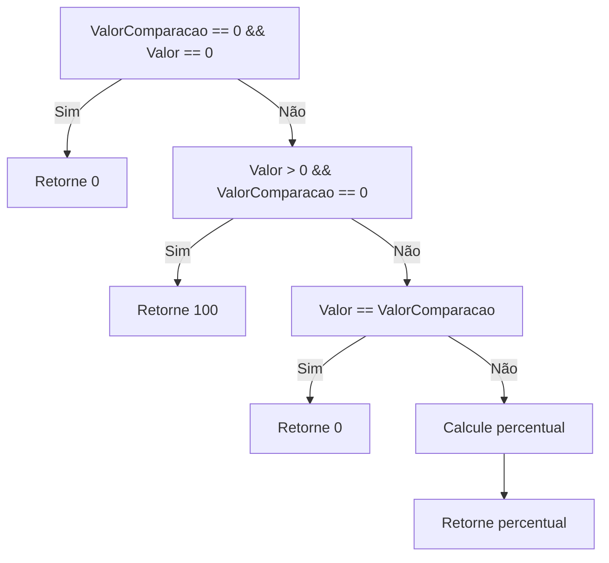

# IndicadorKPI
**Namespace**: IsthmusWinthor.Dominio.Analytics.Indicadores  
**Nome do Arquivo**: IndicadorKPI.cs  

## Visão Geral e Responsabilidade
A classe `IndicadorKPI` representa um indicador de desempenho (KPI) que fornece dados críticos sobre o desempenho de uma entidade em um determinado período. O problema de negócio que essa classe resolve é a necessidade de calcular e comparar o desempenho através de métricas quantitativas, permitindo que os stakeholders compreendam o crescimento ou a variação em relação a um dia de comparação específico.

## Métodos de Negócio
### Título: PercentualCrescimento (Público)
- **Objetivo**: Calcular o percentual de crescimento entre o valor atual e um valor de comparação.
- **Comportamento**:
  1. Verifica se ambos `ValorComparacao` e `Valor` são iguais a zero, retornando 0%.
  2. Se o `Valor` for maior que zero e `ValorComparacao` for zero, retorna 100%.
  3. Se `Valor` é igual a `ValorComparacao`, retorna 0%.
  4. Calcula o percentual de crescimento utilizando a fórmula: \(((Valor - ValorComparacao) * 100) / ValorComparacao\).
  5. Arredonda o resultado para duas casas decimais.
- **Retorno**: Retorna um decimal que representa o percentual de crescimento em relação ao valor de comparação.

### Título: ValorFormatado (Público)
- **Objetivo**: Formatar o valor do indicador com base no tipo de KPI.
- **Comportamento**:
  1. Verifica se o `Indicador` é igual a `KPIEnum.ValorTotal` ou `KPIEnum.TicketMedio`.
  2. Se sim, formata o valor como dinheiro.
  3. Se não, usa a parte inteira do valor.
- **Retorno**: Retorna uma string que representa o valor formatado.

### Título: PercentualCrescimentoFormatado (Público)
- **Objetivo**: Formatar o percentual de crescimento como uma string em porcentagem.
- **Comportamento**:
  1. Chama o método `Math.Round` para arredondar o percentual de crescimento para duas casas decimais.
  2. Concatena o símbolo de porcentagem '%' ao resultado.
- **Retorno**: Retorna uma string que representa o percentual formatado.

## Propriedades Calculadas e de Validação
- **PercentualCrescimento**: Calcula o percentual de crescimento entre `Valor` e `ValorComparacao`, seguindo regras de negócios bem definidas.
- **ValorFormatado**: Aplica diferentes formatações no valor do KPI, dependendo do tipo do indicador.

## Navigation Property
- **Indicador**: Link para o arquivo presumido [KPIEnum](KPIEnum.md).

## Tipos Auxiliares e Dependências
- **Enumerador**: [KPIEnum](KPIEnum.md)
- **Classes Estáticas/Helpers**: 
  - `ToMoney()`: Método de extensão que formata valores para moeda.

## Diagrama de Relacionamentos

---
Gerada em 29/12/2025 20:08:00
