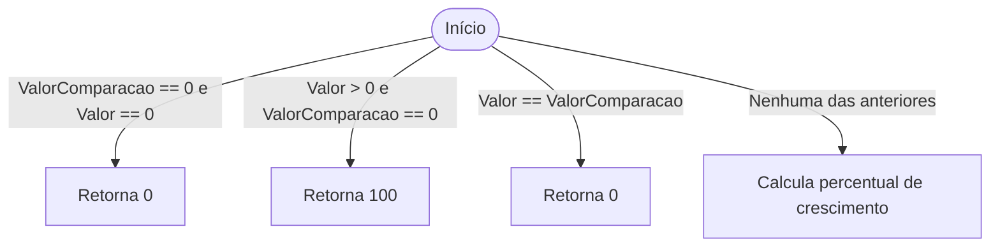
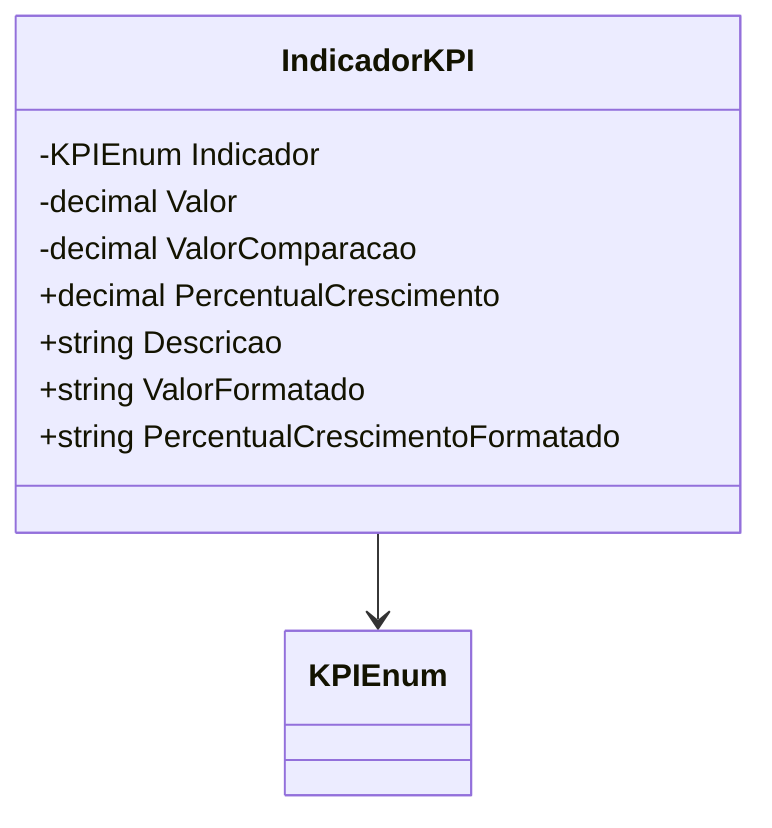

# IndicadorKPI

**Namespace**: IsthmusWinthor.Dominio.Analytics.Indicadores  
**Nome do Arquivo**: IndicadorKPI.cs  

## Visão Geral e Responsabilidade
A classe `IndicadorKPI` atua como um motor de cálculo para indicadores chave de desempenho (KPIs) no contexto corporativo. Destina-se a analisar o crescimento percentual e fornecer formatações específicas dos valores de indicadores, permitindo comparações precisas entre períodos de tempo. Resolve o problema de apresentar dados analíticos complexos de maneira facilmente entendível para o usuário.

## Métodos de Negócio

### PercentualCrescimento (Getter)
- **Objetivo**: Calcula o percentual de crescimento entre dois valores de tempo separados: `Valor` e `ValorComparacao`.
- **Comportamento**:  
  1. Se ambos `Valor` e `ValorComparacao` forem zero, retorna 0.
  2. Se `Valor` é maior que 0 e `ValorComparacao` é zero, retorna 100% indicando crescimento total.
  3. Se `Valor` é igual a `ValorComparacao`, retorna 0.
  4. Caso contrário, calcula o percentual usando a fórmula: `((Valor - ValorComparacao) * 100 / ValorComparacao)`.
  5. Arredonda o resultado para duas casas decimais, considerando a aproximação para cima.
- **Retorno**: Percentual de crescimento formatado como decimal.

### **VISUALIZAÇÃO:**

## Propriedades Calculadas e de Validação

- **PercentualCrescimento**: Valor calculado conforme a lógica de negócio acima, representando o crescimento percentual entre dois pontos de dados.
- **ValorFormatado**: Formatação condicional baseada no tipo de `Indicador`. Arredonda e formata valores monetários adequadamente.
- **PercentualCrescimentoFormatado**: Formata o valor de `PercentualCrescimento` anexando o símbolo de porcentagem.

## Navigations Property
- **Indicador**: Tipo de KPI gerenciado, vinculado ao enumeração `KPIEnum`.

## Tipos Auxiliares e Dependências
- [KPIEnum](KPIEnum.md): Enumeração utilizada para identificar o tipo de indicador.
- Utiliza métodos de extensão para formatação de valores, presumivelmente de uma classe estática utilitária.

## Diagrama de Relacionamentos

