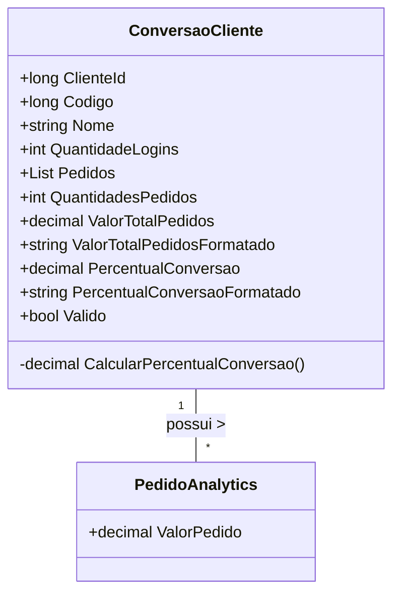

# ConversaoCliente
**Namespace**: IsthmusWinthor.Dominio.Analytics.Pedidos  
**Nome do Arquivo**: ConversaoCliente.cs

## Visão Geral e Responsabilidade
A classe `ConversaoCliente` é responsável por calcular e representar a taxa de conversão de clientes baseada em suas atividades de login e pedidos. Esse modelo de domínio quantifica o desempenho dos clientes em termos de suas interações com a plataforma, fornecendo métricas valiosas para análises de performance e estratégia de marketing.

## Métodos de Negócio

### Título: CalcularPercentualConversao (private)
- **Objetivo**: Garante o cálculo correto do percentual de conversão, que é a relação entre o número de pedidos realizados e o número de logins do cliente.
- **Comportamento**:
  1. Verifica se a quantidade de logins é igual a zero.
     - Se sim, retorna 0, evitando divisão por zero.
  2. Se houver logins, calcula o percentual dividindo o número total de pedidos pelo número de logins, multiplicando por 100.
- **Retorno**: Retorna um valor decimal representando a taxa de conversão percentual.

```mermaid
flowchart TD
    A[Início] --> B{QuantidadeLogins == 0}
    B -- Sim --> C[Retorna 0]
    B -- Não --> D[Calcula Percentual: (100 * QuantidadesPedidos) / QuantidadeLogins]
    D --> E[Retorna Percentual Conversão]
```

## Propriedades Calculadas e de Validação
- **QuantidadesPedidos**: Retorna o número total de pedidos feitos pelo cliente, utilizando a contagem da lista `Pedidos`.
- **ValorTotalPedidos**: Calcula a soma total dos valores dos pedidos, iterando sobre a lista `Pedidos`.
- **ValorTotalPedidosFormatado**: Formata o valor total dos pedidos em uma representação monetária.
- **PercentualConversao**: Calcula o percentual de conversão com base nos logins e pedidos.
- **PercentualConversaoFormatado**: arredonda o percentual de conversão para duas casas decimais e o converte para string.

## Navigations Property
- **Pedidos**: [PedidoAnalytics](PedidoAnalytics.md)

## Tipos Auxiliares e Dependências
- **Método de Extensão**: `.ToMoney()`: O método de extensão usado para formatação monetária deve ser definido em algum helper ou extensão.
  
## Diagrama de Relacionamentos

---
Gerada em 29/12/2025 20:08:17
