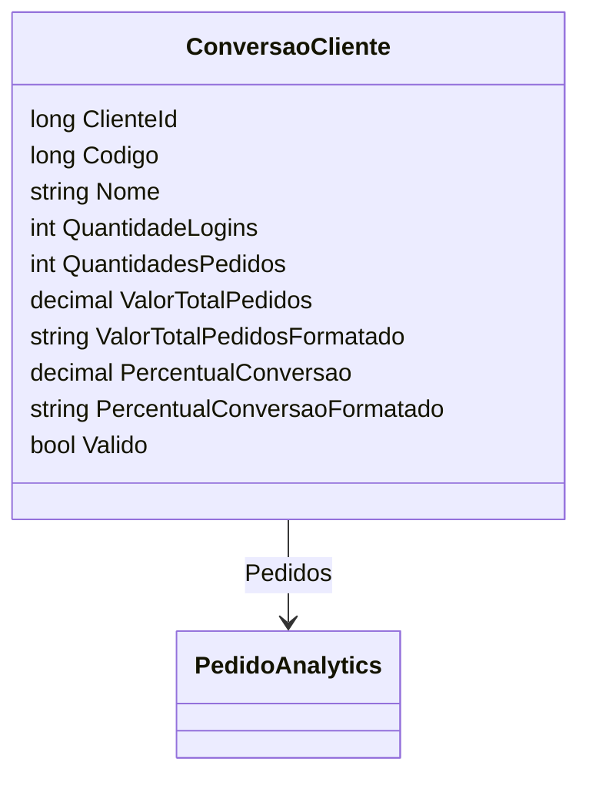

# ConversaoCliente

- **Namespace**: IsthmusWinthor.Dominio.Analytics.Pedidos
- **Nome do Arquivo**: ConversaoCliente.cs

## Visão Geral e Responsabilidade

A classe `ConversaoCliente` atua como um Motor de Cálculo para a análise de conversão de clientes dentro do sistema de pedidos. Ela se concentra na captura, análise e cálculo de métricas específicas, como a quantidade de pedidos, o valor total de pedidos e, principalmente, o percentual de conversão de clientes. O problema de negócio que essa classe resolve é medir a eficácia do comportamento de clientes baseado na quantidade de logins e pedidos realizados, o que é essencial para ajustes estratégicos na experiência do consumidor e nas campanhas de marketing.

## Métodos de Negócio

- ### CalcularPercentualConversao (Privado)
  - **Objetivo**: Calcula o percentual de conversão de um cliente com base nos logins e pedidos realizados.
  - **Comportamento**: 
    1. Verifica se a quantidade de logins é zero.
    2. Se sim, retorna 0 para evitar divisão por zero e indicar nenhuma conversão.
    3. Caso contrário, calcula o percentual de conversão dividindo a quantidade de pedidos pela quantidade de logins e multiplica por 100 para obter a porcentagem.
  - **Retorno**: Retorna o percentual de conversão como um valor `decimal` representando a eficácia da conversão de logins em pedidos.

  ```mermaid
  flowchart TD
      A[Início] --> B{QuantidadeLogins == 0?}
      B -- Sim --> C[Retorna 0]
      B -- Não --> D[Calcula (100 * QuantidadesPedidos) / QuantidadeLogins]
      D --> E[Retorna Valor Calculado]
  ```

## Propriedades Calculadas e de Validação

- **QuantidadesPedidos**: Calcula o número total de pedidos relacionados ao cliente pela propriedade `Pedidos`.
- **ValorTotalPedidos**: Calcula a soma de todos os valores dos pedidos.
- **ValorTotalPedidosFormatado**: Formata o `ValorTotalPedidos` como uma representação monetária.
- **PercentualConversao**: Utiliza o método privado `CalcularPercentualConversao` para obter o percentual baseado em logins e pedidos.
- **PercentualConversaoFormatado**: Formata o `PercentualConversao` arredondado a duas casas decimais.

## Navigations Property

- **Pedidos**: 
  - Lista de instâncias de `PedidoAnalytics` representando os pedidos associados ao cliente.
  - [PedidoAnalytics](PedidoAnalytics.md)

## Tipos Auxiliares e Dependências

- Extensão de método `ToMoney` para formatação monetária.
- `PedidoAnalytics`: Presumivelmente contém informações sobre os pedidos, incluindo valor.

## Diagrama de Relacionamentos


