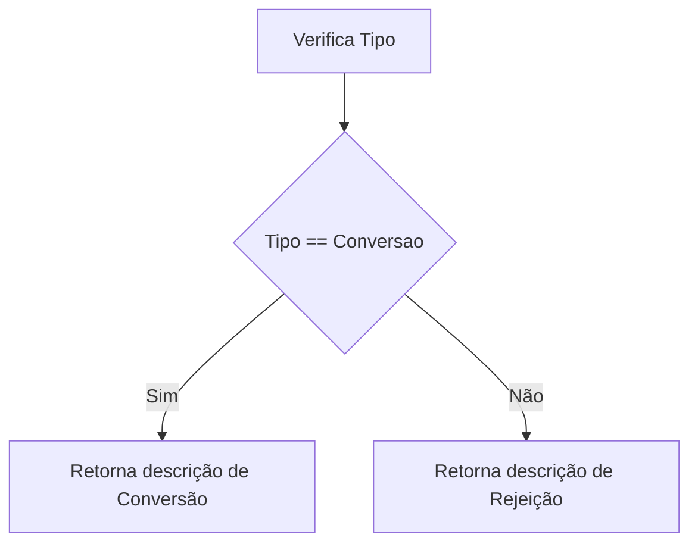
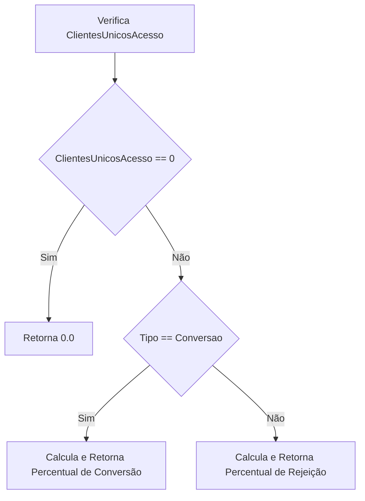
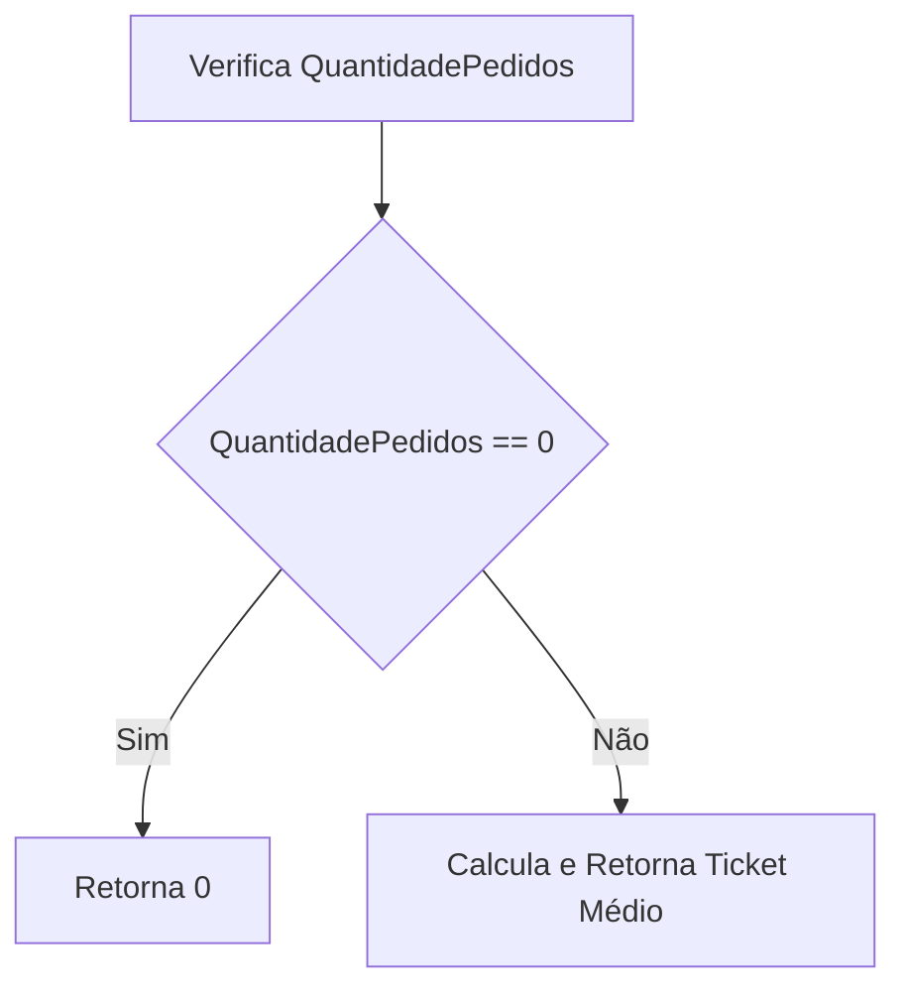
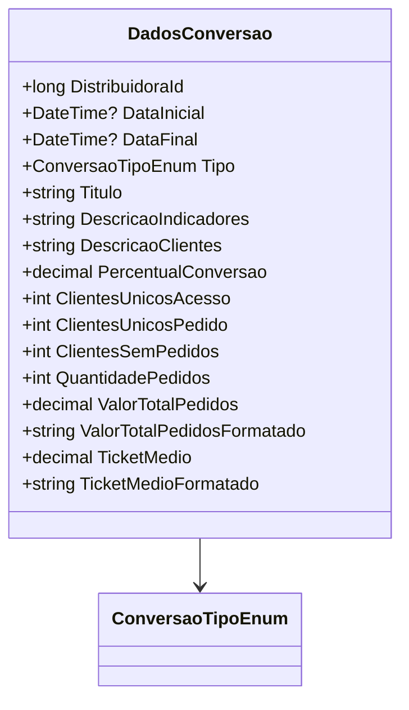

# DadosConversao

- **Namespace**: IsthmusWinthor.Dominio.Analytics.Pedidos
- **Nome do Arquivo**: DadosConversao.cs

## Visão Geral e Responsabilidade

A classe `DadosConversao` atua como um motor de cálculo para determinar métricas de conversão e rejeição de pedidos no contexto de uma plataforma B2B. Ela calcula e formata valores extraídos de interações de clientes, como o percentual de conversões e rejeições, baseando-se em entradas sobre acessos e pedidos realizados. Essa classe é crucial para gerar insights de negócios sobre o comportamento do cliente, identificando padrões de engajamento.

## Métodos de Negócio

### Título: DescricaoIndicadores (getter)

- **Objetivo**: Garante a descrição formatada dos indicadores de conversão ou rejeição, dependendo do `ConversaoTipoEnum`.
- **Comportamento**: 
  - Verifica o tipo de conversão.
  - Se o tipo for `Conversao`, retorna a descrição de percentual de conversão utilizando `ClientesUnicosAcesso` e `ClientesUnicosPedido`.
  - Se for outro tipo, retorna a descrição de percentual de rejeição utilizando `ClientesUnicosAcesso`.
- **Retorno**: Uma string formatada contendo a descrição do indicador atual.

### Título: PercentualConversao (getter)

- **Objetivo**: Calcula o percentual de conversão ou rejeição baseando-se no tipo selecionado.
- **Comportamento**: 
  - Confere se `ClientesUnicosAcesso` é igual a zero, retornando zero no percentual.
  - Para `Tipo == Conversao`, calcula o percentual de conversão.
  - Caso contrário, calcula o percentual de rejeição.
- **Retorno**: Um decimal representando o percentual calculado, arredondado para duas casas decimais.

### Título: TicketMedio (getter)

- **Objetivo**: Calcula o ticket médio por pedido.
- **Comportamento**: 
  - Verifica se `QuantidadePedidos` é zero, retornando zero para o ticket médio.
  - Caso contrário, calcula o ticket médio dividindo `ValorTotalPedidos` por `QuantidadePedidos`.
- **Retorno**: Um decimal representando o ticket médio.

## Propriedades Calculadas e de Validação

- **Titulo**: Retorna a descrição baseada no `ConversaoTipoEnum`.
- **PercentualConversao**: Calcula o percentual de conversão ou rejeição com base nas propriedades atuais.
- **ValorTotalPedidosFormatado**: Formata `ValorTotalPedidos` para uma representação monetária.
- **TicketMedioFormatado**: Formata `TicketMedio` para uma representação monetária.

## Navigations Property

Nenhuma.

## Tipos Auxiliares e Dependências

- **Enumerador**: [ConversaoTipoEnum](ConversaoTipoEnum.md)
- **Helpers estáticos**: Métodos `.Description()` e `.ToMoney()`.

## Diagrama de Relacionamentos

