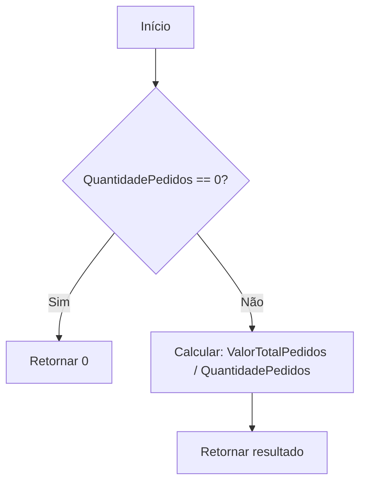
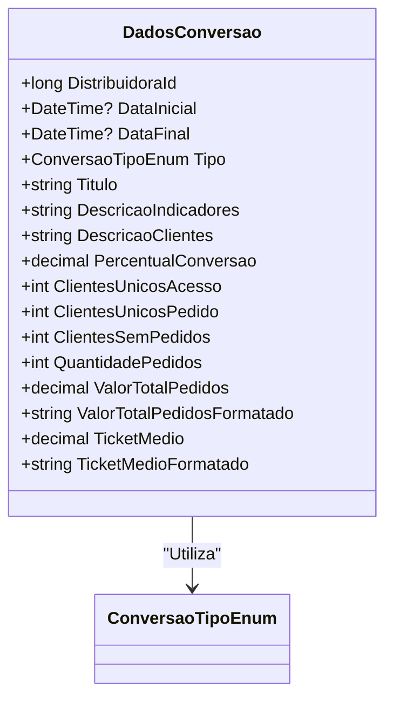

# DadosConversao
**Namespace**: IsthmusWinthor.Dominio.Analytics.Pedidos  
**Nome do Arquivo**: DadosConversao.cs  

## Visão Geral e Responsabilidade
A classe `DadosConversao` representa um modelo rico que encapsula a lógica de cálculo e avaliação de métricas de conversão e rejeição de clientes em um sistema B2B. Seu papel central é oferecer insights sobre a eficácia de conversões de clientes com base em dados de pedidos, informando a equipe de negócios sobre taxas de conversão e rejeição dentro de períodos específicos, facilitando decisões estratégicas.

## Métodos de Negócio

### Título: PercentualConversao (Visibilidade: público)
- **Objetivo**: Garante o cálculo correto da taxa de conversão ou rejeição com base na categoria de conversão em uso.
- **Comportamento**:
  1. Verifica se `ClientesUnicosAcesso` é zero. Se sim, retorna 0,0.
  2. Se o tipo de conversão for `Conversao`, calcula a porcentagem de clientes que enviaram pedidos em relação aos que acessaram.
  3. Se o tipo for diferente, calcula a porcentagem de clientes que não efetuaram pedidos.
- **Retorno**: Retorna um valor decimal representando a taxa percentual de conversão ou rejeição.

```mermaid
flowchart TD
    A[Início] --> B{"ClientesUnicosAcesso == 0?"}
    B -- Sim --> C[Retornar 0.0]
    B -- Não --> D{"Tipo == Conversao?"}
    D -- Sim --> E[Calcular: (100 * ClientesUnicosPedido / ClientesUnicosAcesso)]
    D -- Não --> F[Calcular: (100 * ClientesSemPedidos / ClientesUnicosAcesso)]
    E --> G[Retornar resultado]
    F --> G[Retornar resultado]
```

### Título: TicketMedio (Visibilidade: público)
- **Objetivo**: Calcula o ticket médio dos pedidos realizados no período selecionado.
- **Comportamento**:
  1. Verifica se `QuantidadePedidos` é zero. Se sim, retorna 0.
  2. Se não, divide o `ValorTotalPedidos` pela `QuantidadePedidos` para obter o valor médio por pedido.
- **Retorno**: Retorna um valor decimal representando o ticket médio dos pedidos.



## Propriedades Calculadas e de Validação
- **Titulo**: Retorna a descrição do tipo de conversão associado, usando método extension `Description()`.
- **DescricaoIndicadores**: Gera uma descrição com base no tipo de conversão, diferenciando entre conversões e rejeições.
- **DescricaoClientes**: Fornece descrição para conversões ou rejeições, baseada no `Tipo`.
- **ValorTotalPedidosFormatado**: Formata o valor total dos pedidos em um formato monetário.
- **TicketMedioFormatado**: Formata o ticket médio em um formato monetário.

## Navigations Property
Não existem propriedades que sejam classes complexas do domínio nesta classe.

## Tipos Auxiliares e Dependências
- **Enumeradores**: [ConversaoTipoEnum](ConversaoTipoEnum.md)
- **Helpers**: Métodos de extensão não especificados que envolvem o uso de `ToMoney()`.

## Diagrama de Relacionamentos

---
Gerada em 29/12/2025 20:08:39
