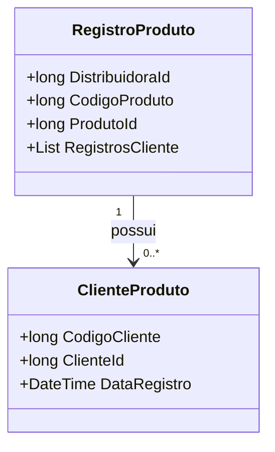

# RegistroProduto

**Namespace**: IsthmusWinthor.Dominio.Analytics.Produtos  
**Nome do Arquivo**: RegistroProduto.cs  

## Visão Geral e Responsabilidade
A classe `RegistroProduto` funciona como um modelo para armazenar dados brutos relacionados a interações dos clientes com produtos, como adições, remoções, visualizações e compras. Essa estrutura é fundamental para a análise do comportamento de compra e uso de produtos, permitindo que a empresa compreenda melhor as preferências e tendências de consumo, além de possibilitar relatórios detalhados que informam decisões comerciais estratégicas.

## Métodos de Negócio
- **Título**: *Não aplicável neste caso*  
  **Objetivo**: Não há métodos com lógica de negócio complexa na classe `RegistroProduto`.  
  **Comportamento**: A classe é mais um modelo de dados para transporte de informações.  
  **Retorno**: Não aplicável.  

## Propriedades Calculadas e de Validação
- A classe não contém propriedades com lógica de cálculo ou validação intrínsecas nas propriedades.

## Navigations Property
- `RegistrosCliente`: 
  - [ClienteProduto](ClienteProduto.md)

## Tipos Auxiliares e Dependências
- Não há enumeradores ou classes auxiliares diretamente utilizadas na classe `RegistroProduto`.

## Diagrama de Relacionamentos

---
Gerada em 29/12/2025 20:08:55
