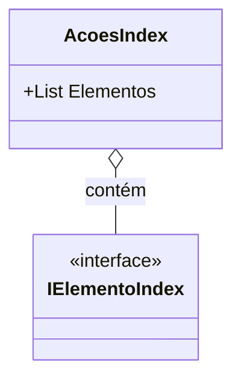

# AcoesIndex<T>

**Namespace**: IsthmusWinthor.Dominio.AzureSearchIndex  
**Nome do Arquivo**: AcoesIndex.cs  

## Visão Geral e Responsabilidade
A classe `AcoesIndex<T>` atua como um modelo genérico para manipulação de um conjunto de elementos que implementam a interface `IElementoIndex`. Sua principal responsabilidade é agrupar e facilitar o transporte de uma lista de elementos indizados, permitindo operações sobre esses dados. Este modelo é crucial para a integração com sistemas de busca baseados em Azure, onde a eficiência no manuseio de dados indizados é vital para garantir desempenho em consultas e operações.

## Métodos de Negócio
Esta classe não contém métodos de negócio com lógica complexa a serem descritos.

## Propriedades Calculadas e de Validação
- Esta classe possui a propriedade `Elementos`, que é uma lista de tipo genérico `List<T>`. Não há lógica de cálculo ou validação associada a esta propriedade, pois ela serve meramente como um contêiner de dados.

## Navigations Property
- A classe não possui propriedades complexas ou de navegação a serem listadas.

## Tipos Auxiliares e Dependências
- A classe utiliza a interface `IElementoIndex`, que deve ser previamente definida em outro local do código. [IElementoIndex](IElementoIndex.md).

## Diagrama de Relacionamentos

---
Gerada em 29/12/2025 20:09:06
