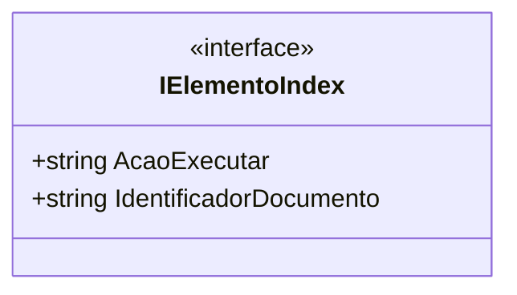

# IElementoIndex
**Namespace**: IsthmusWinthor.Dominio.AzureSearchIndex  
**Nome do Arquivo**: IElementoIndex.cs

### Visão Geral e Responsabilidade
A interface `IElementoIndex` define um contrato para os elementos que serão indexados em um sistema de busca baseado em Azure. Sua principal responsabilidade é garantir que cada elemento tenha um identificador único e uma ação associada a ele durante o processo de indexação. Isso é crucial para a integridade dos dados e a correta execução das operações de busca e apresentação dos resultados.

### Métodos de Negócio
#### Título: Não aplicável (interface não possui métodos implementados com lógica)
- **Objetivo**: Como esta é uma interface, não há métodos com lógica de negócio, mas os implementadores devem garantir que a lógica relacionada às ações e identificadores seja mantida.
- **Comportamento**: Nenhum comportamento implementado. Os métodos que implementarem esta interface devem seguir as regras de negócio relacionadas ao manuseio e indexação de dados.
- **Retorno**: N/A

### Propriedades Calculadas e de Validação
Não há propriedades com lógica complexa de validação ou cálculo na interface `IElementoIndex`, uma vez que é uma interface que apenas declara propriedades anêmicas que devem ser implementadas.

### Navigations Property
Não existem propriedades de navegação complexas dentro da interface, visto que, como uma interface, ela não define outros tipos de classes complexas ou dependências.

### Tipos Auxiliares e Dependências
- **Dependências**:
  - `Newtonsoft.Json.JsonProperty` é utilizado para a serialização e deserialização dos dados, permitindo a personalização do mapeamento entre propriedades C# e os nomes de propriedades JSON.

### Diagrama de Relacionamentos

Este diagrama de classes representa a interface `IElementoIndex` e suas propriedades. Como não há implementações diretas ou tipos auxiliares adicionais, o diagrama é simples e direto.
---
Gerada em 29/12/2025 20:09:20
