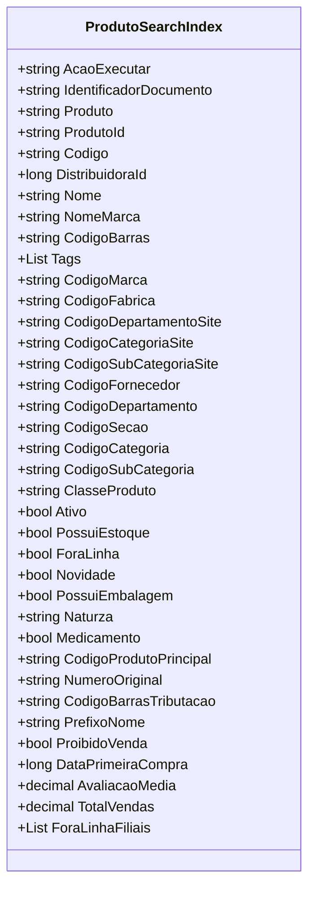

# ProdutoSearchIndex
**Namespace**: IsthmusWinthor.Dominio.AzureSearchIndex  
**Nome do Arquivo**: ProdutoSearchIndex.cs  

## Visão Geral e Responsabilidade
A classe `ProdutoSearchIndex` atua como um modelo de domínio rico que encapsula as informações e regras relacionadas à indexação de produtos em um sistema de busca. Ela é responsável por garantir que os dados dos produtos sejam organizados e manipulados corretamente, facilitando a busca e a filtragem desses produtos em uma interface de usuário ou API. A classe assegura que informações críticas sobre cada produto, como identificação, disponibilidade e categorização, estejam sempre estruturadas e acessíveis para os processos de busca.

## Métodos de Negócio
A condição da classe `ProdutoSearchIndex` não contém métodos de lógica complexa a serem documentados, pois se concentra em representar os dados do produto.

## Propriedades Calculadas e de Validação
- **PrefixoNome**: A propriedade `PrefixoNome` retorna o primeiro nome contido na string `Nome`, garantindo que o prefixo seja obtido corretamente se a propriedade `Nome` não estiver vazia. Assim, é uma lógica de validação e cálculo ao acessar esta propriedade.
  
## Navigation Property
A classe `ProdutoSearchIndex` não possui propriedades complexas do domínio que representem relacionamentos diretos.

## Tipos Auxiliares e Dependências
- Nenhum enumerador ou classe estática é utilizado por esta classe.

## Diagrama de Relacionamentos

---

# ProdutoSearchIndexMenuFiltro
**Namespace**: IsthmusWinthor.Dominio.AzureSearchIndex  
**Nome do Arquivo**: ProdutoSearchIndexMenuFiltro.cs  

Esta classe se destina a transportar dados que definem filtros aplicáveis na busca de produtos, encapsulando as informações relacionadas à marca, departamento e categoria dos produtos a serem filtrados em um sistema de busca.
---
Gerada em 29/12/2025 20:09:40
