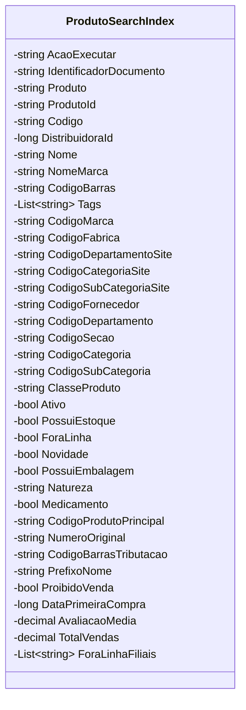

# ProdutoSearchIndex

**Namespace**: IsthmusWinthor.Dominio.AzureSearchIndex  
**Nome do Arquivo**: ProdutoSearchIndex.cs  

## Visão Geral e Responsabilidade
A classe `ProdutoSearchIndex` funciona como um modelo de domínio rico, representando os produtos que serão indexados em um ambiente de busca no Azure. Esta classe é responsável por gerenciar as informações associadas a produtos, como identificadores, nomes, códigos e várias propriedades categóricas e de marca. Ela também determina características importantes do produto, como disponibilidade, estoque e status de novidade ou descontinuação. Isso facilita as operações de busca e categorização de produtos no sistema.

## Métodos de Negócio

### PrefixoNome (Público)
* **Objetivo**: Calcula e retorna o prefixo do nome do produto, geralmente a primeira palavra do nome.
* **Comportamento**: Divide o nome do produto com base no espaço e retorna a primeira palavra.
* **Retorno**: O valor retornado é uma string que representa o prefixo do nome. Se o nome for nulo ou vazio, retorna uma string vazia.

## Propriedades Calculadas e de Validação

- **PrefixoNome**: Esta propriedade calculada extrai a primeira palavra do nome do produto. A lógica verifica se o nome está vazio ou nulo, retornando uma string vazia nesse caso, caso contrário, divide o nome usando espaço como delimitador e retorna a primeira parte.

## Navigations Property

*Não há propriedades de navegação que representem objetos complexos do domínio, pois esta classe se concentra em tipos primitivos e listas simples.*

## Tipos Auxiliares e Dependências

A classe `ProdutoSearchIndex` não utiliza enumeradores nem classes estáticas ou helpers que necessitem de referência ou link.

## Diagrama de Relacionamentos

---

# ProdutoSearchIndexMenuFiltro

**Namespace**: IsthmusWinthor.Dominio.AzureSearchIndex  
**Nome do Arquivo**: ProdutoSearchIndexMenuFiltro.cs  

> `ProdutoSearchIndexMenuFiltro` é um DTO utilizado para transportar dados de filtros de menu para o sistema de indexação.
