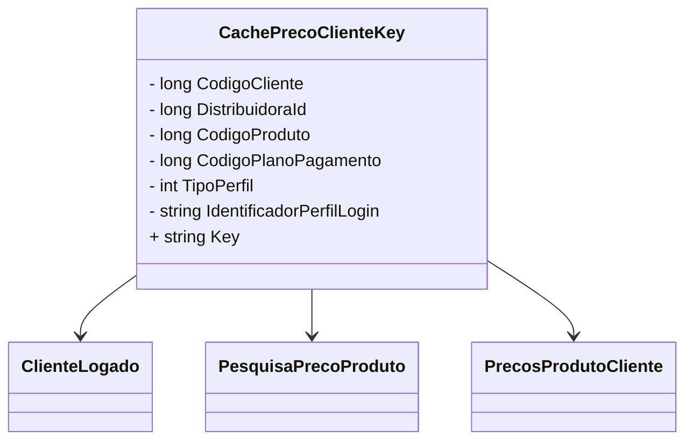

# CachePrecoClienteKey

**Namespace**: IsthmusWinthor.Dominio.CacheKeys  
**Nome do Arquivo**: CachePrecoClienteKey.cs  

## Visão Geral e Responsabilidade
A classe `CachePrecoClienteKey` atua como um gerador de chaves de cache específicas para o armazenamento e recuperação de preços de produtos personalizados para clientes no contexto de uma distribuidora. Este componente é crucial para garantir alta eficiência e rapidez no acesso a dados frequentemente requisitados por operações de preço, integrando informações de cliente, produto e outros parâmetros relevantes.

## Métodos de Negócio

### CachePrecoClienteKey (Construtor) - Público
* **Objetivo**: Inicializar uma chave que será utilizada no cache para identificar unicamente os preços associados a um cliente específico.
* **Comportamento**: 
  1. Recebe parâmetros como código do cliente, ID da distribuidora, código do produto, código do plano de pagamento, tipo de perfil e identificador do perfil de login.
  2. Atribui estes valores às propriedades correspondentes da classe.

### Conversão Implícita de Tupla (PesquisaPrecoProduto, ClienteLogado) para CachePrecoClienteKey - Pública
* **Objetivo**: Facilitar a geração de uma chave de cache a partir de instâncias de `PesquisaPrecoProduto` e `ClienteLogado`.
* **Comportamento**:
  1. Extrai informações necessárias de `PesquisaPrecoProduto` e `ClienteLogado`.
  2. Constrói uma nova instância de `CachePrecoClienteKey`, popula seus campos com os valores extraídos.

### Conversão Implícita de Tupla (PrecosProdutoCliente, ClienteLogado) para CachePrecoClienteKey - Pública
* **Objetivo**: Criar uma chave de cache a partir dos objetos `PrecosProdutoCliente` e `ClienteLogado`.
* **Comportamento**:
  1. Recupera dados de `PrecosProdutoCliente` e `ClienteLogado`.
  2. Instancia `CachePrecoClienteKey`, inicializando com os valores destes objetos.

## Propriedades Calculadas e de Validação

### Key (get) - Pública
* **Objetivo**: Fornecer uma chave de string única baseada nas propriedades da classe.
* **Comportamento**:
  - Combina os valores das propriedades `DistribuidoraId`, `CodigoCliente`, `CodigoPlanoPagamento`, `CodigoProduto`, `TipoPerfil` e `IdentificadorPerfilLogin` em uma string formatada como "DistribuidoraId:CodigoCliente:CodigoPlanoPagamento:CodigoProduto:TipoPerfil:IdentificadorPerfilLogin".

## Navigations Property
- **ClienteLogado**: Presume-se um link implícito a essa classe para gerar a chave de cache.
- **PesquisaPrecoProduto**: Utilizado para conversão implícita.
- **PrecosProdutoCliente**: Utilizado para conversão implícita.

## Tipos Auxiliares e Dependências
- `[ClienteLogado](ClienteLogado.md)`
- `[PesquisaPrecoProduto](PesquisaPrecoProduto.md)`
- `[PrecosProdutoCliente](PrecosProdutoCliente.md)`

## Diagrama de Relacionamentos

