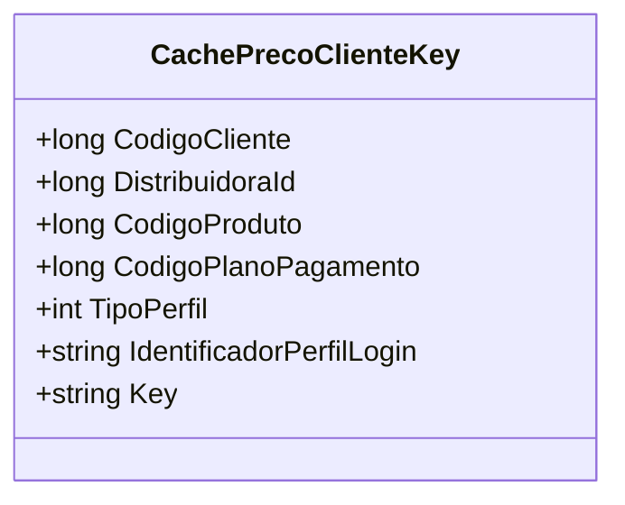

# CachePrecoClienteKey
**Namespace**: IsthmusWinthor.Dominio.CacheKeys  
**Nome do Arquivo**: CachePrecoClienteKey.cs

## Visão Geral e Responsabilidade
A classe `CachePrecoClienteKey` é responsável por representar uma chave de cache que facilita o armazenamento e recuperação de informações de preços de produtos para clientes. Ela encapsula vários dados relevantes, como códigos de cliente, distribuidora, produto e plano de pagamento, além de informações específicas sobre o perfil do cliente. Essa estrutura é essencial para garantir a integridade dos dados em cache, promovendo operações eficientes de busca e atualizações de preços, com base nas especificações de cada cliente e produto.

## Métodos de Negócio

### Título: Key (Propriedade pública)
- **Objetivo**: Garante a geração de uma chave única de cache que identifica de forma exclusiva a combinação de dados fornecidos ao cliente, ao produto e ao perfil.
- **Comportamento**: Constrói a chave utilizando os atributos `DistribuidoraId`, `CodigoCliente`, `CodigoPlanoPagamento`, `CodigoProduto`, `TipoPerfil` e `IdentificadorPerfilLogin`, concatenando-os com o caractere `:` como delimitador.
- **Retorno**: Retorna uma string que representa a chave formada a partir da combinação dos valores atribuídos às propriedades da classe.

## Propriedades Calculadas e de Validação
N/A (a classe apenas possui propriedades de dados e não contém lógicas de cálculo ou validação nas operações de `get` ou `set`).

## Navigations Property
N/A (não há propriedades que referenciem classes complexas do domínio).

## Tipos Auxiliares e Dependências
- Nenhum enumerador ou classe auxiliar utilizada nesse contexto.

## Diagrama de Relacionamentos

---
Gerada em 29/12/2025 20:09:54
