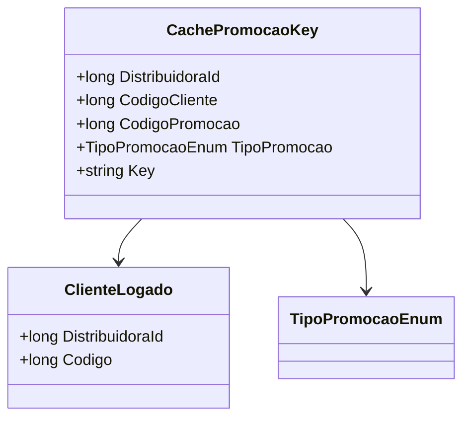

# CachePromocaoKey

**Namespace**: IsthmusWinthor.Dominio.CacheKeys  
**Nome do Arquivo**: CachePromocaoKey.cs  

## Visão Geral e Responsabilidade
A classe `CachePromocaoKey` atua como um identificador exclusivo para chaves de cache no sistema de promoções. Ela permite a construção de uma chave única, composta pela combinação dos identificadores de distribuidora, cliente, tipo de promoção e código da promoção. Responde ao problema de garantir acesso e controle rápido a dados em cache associados a promoções específicas.

## Propriedades Calculadas e de Validação

### Key
- **Descrição**: A propriedade `Key` constrói uma string que serve como uma chave única no cache, baseada nos atributos da classe.
- **Regra de Negócio**: Ela formata e concatena os identificadores (DistribuidoraId, CodigoCliente, TipoPromocao, CodigoPromocao) separados por dois-pontos para criar uma chave única.
- **Cálculo**: `Key => $"{DistribuidoraId}:{CodigoCliente}:{TipoPromocao}:{CodigoPromocao}"`

## Navigations Property
Nenhuma.

## Tipos Auxiliares e Dependências

- `[TipoPromocaoEnum](TipoPromocaoEnum.md)`: Enumerador que especifica o tipo de promoção.
- `[ClienteLogado](ClienteLogado.md)`: POCO que representa os detalhes do cliente logado no sistema.

## Diagrama de Relacionamentos

Esta documentação resume a função e as regras de negócio implementadas pela classe `CachePromocaoKey`, destacando, particularmente, sua capacidade de gerar chaves de cache únicas para operações eficientes de armazenamento em cache de promoções.
