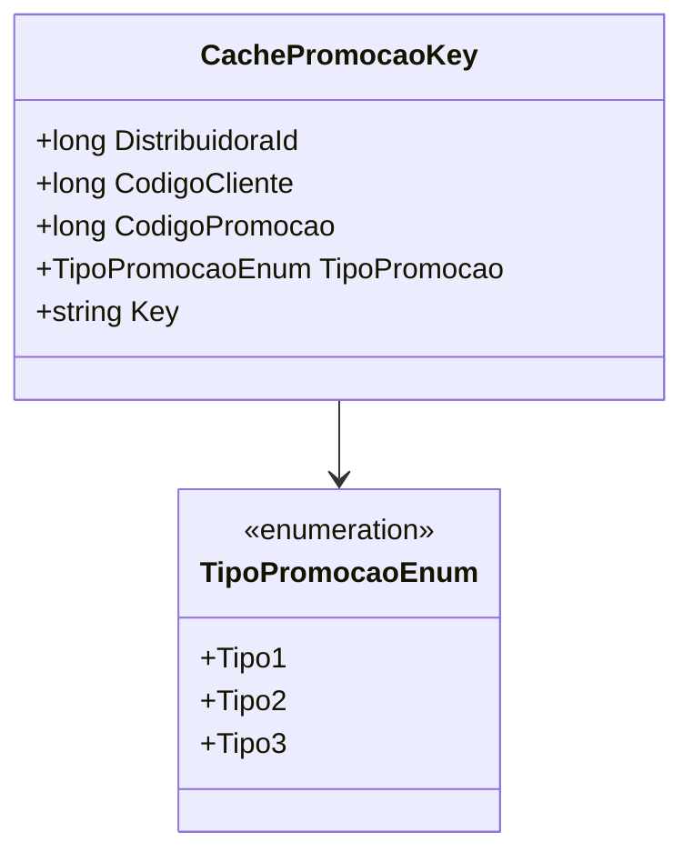

# CachePromocaoKey
**Namespace**: IsthmusWinthor.Dominio.CacheKeys  
**Nome do Arquivo**: CachePromocaoKey.cs  

## Visão Geral e Responsabilidade
A classe `CachePromocaoKey` é um Rich Domain Model que representará uma chave de cache relacionada a promoções. Ela permite a criação de uma chave única que combina informações do cliente e da promoção, ajudando a otimizar o acesso e o gerenciamento de dados em cache referente a promoções específicas para cada cliente. Isso é crucial para garantir que os dados recuperados sejam pertinentes e estejam atualizados, contribuindo para a eficiência e a performance do sistema.

## Métodos de Negócio

### Título: `Key` (Propriedade Pública)
- **Objetivo**: Gera uma chave única para o cache.
- **Comportamento**: A propriedade `Key` concatena `DistribuidoraId`, `CodigoCliente`, `TipoPromocao` e `CodigoPromocao` em uma string. Isso garante que cada chave gerada seja única para a combinação de distribuidora, cliente e promoção.
- **Retorno**: Retorna uma string formatada que representa a chave do cache.

## Propriedades Calculadas e de Validação
- `Key`: A propriedade calcula uma chave única do cache com base nas propriedades da classe. A regra por trás do cálculo é garantir que cada combinação de cliente, distribuição e promoção gere uma string única para fácil acesso e recuperação no sistema de cache.

## Navigations Property
- Esta classe não possui propriedades que são classes complexas do domínio.

## Tipos Auxiliares e Dependências
- [TipoPromocaoEnum](TipoPromocaoEnum.md): Enumerador que representa os diferentes tipos de promoções que podem ser aplicadas.

## Diagrama de Relacionamentos

---
Gerada em 29/12/2025 20:10:06
