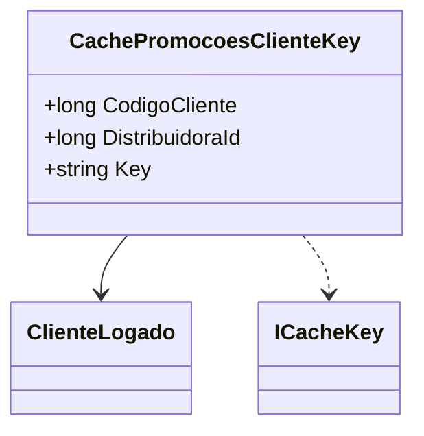

# CachePromocoesClienteKey
**Namespace**: IsthmusWinthor.Dominio.CacheKeys  
**Nome do Arquivo**: CachePromocoesClienteKey.cs  

## Visão Geral e Responsabilidade
A classe `CachePromocoesClienteKey` tem a responsabilidade de criar uma chave de cache única para promoções específicas de clientes. O problema de negócio que ela resolve é a necessidade de associar dados de promoções a um cliente e distribuidora específicos, garantindo que as informações corretas sejam recuperadas de forma eficiente e organizada do sistema de cache.

## Métodos de Negócio

### Título: Key (Propriedade Get)
#### Objetivo: 
Garante que a chave de cache seja gerada de forma consistente a partir dos identificadores do cliente e da distribuidora.

#### Comportamento: 
- Retorna uma string formatada com o `DistribuidoraId` e o `CodigoCliente`, separados por dois pontos.
- Essa formatação assegura que cada combinação de cliente e distribuidora resulte em uma chave de cache única.

#### Retorno: 
Retorna uma string que representa a chave de cache para promoções do cliente, utilizada para armazenamento e recuperação em sistemas de cache.

## Propriedades Calculadas e de Validação
### Propriedades:
- **Key**: 
  - Esta propriedade gera uma chave única para o cache, baseada nas propriedades `DistribuidoraId` e `CodigoCliente`. O padrão de concatenação assegura que as chaves sejam diferenciáveis.

## Navigations Property
- Não há propriedades de navegação complexas nesta classe.

## Tipos Auxiliares e Dependências
- **Interfaces**: [ICacheKey](ICacheKey.md)
- **Classes de Domínio**: [ClienteLogado](ClienteLogado.md)

## Diagrama de Relacionamentos

---
Gerada em 29/12/2025 20:10:19
