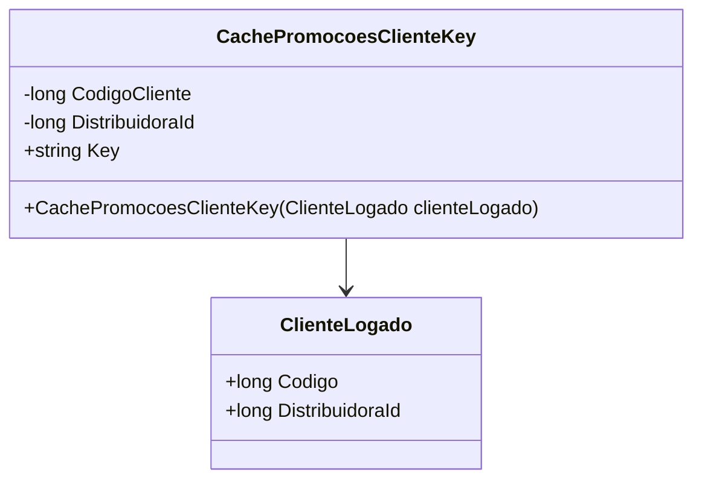

# CachePromocoesClienteKey

- **Namespace**: IsthmusWinthor.Dominio.CacheKeys
- **Nome do Arquivo**: CachePromocoesClienteKey.cs

---

## Visão Geral e Responsabilidade

A classe `CachePromocoesClienteKey` atua como um motor de geração de chaves para caching de promoções específicas de um cliente. Ela resolve o problema de identificação única de promoções por cliente e distribuidora, essencial para recuperar dados do cache de forma eficiente, minimizando chamadas de banco de dados redundantes.

## Métodos de Negócio

### `public CachePromocoesClienteKey(ClienteLogado clienteLogado)`

#### Objetivo
Construtor da classe que inicializa a chave de cache baseada nos dados do cliente logado, garantindo que cada instância seja associada unicamente a um cliente e distribuidora.

#### Comportamento
1. Extrai o `CodigoCliente` do objeto `ClienteLogado`.
2. Extrai o `DistribuidoraId` do objeto `ClienteLogado`.
3. Atribui ambos os valores às propriedades correspondentes da classe.

### `public string Key`

#### Objetivo
Gera a chave única de cache para promoções do cliente, combinando identificadores críticos.

#### Comportamento
- Concatena `DistribuidoraId` e `CodigoCliente` com um separador de dois pontos (`:`) para formar uma chave única.

#### Retorno
Retorna uma `string` que representa a chave de cache única para as promoções de um cliente específico.

## Propriedades Calculadas e de Validação

Não existem getters ou setters com lógica complexa.

## Navigations Property

Não há propriedades de navegação para outras classes de domínio.

## Tipos Auxiliares e Dependências

- `ClienteLogado`: Representa o cliente em sessão. [ClienteLogado](ClienteLogado.md)

## Diagrama de Relacionamentos

