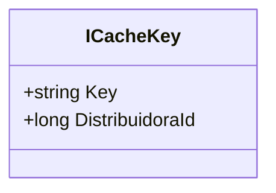

# ICacheKey
**Namespace**: IsthmusWinthor.Dominio.CacheKeys  
**Nome do Arquivo**: ICacheKey.cs

> ICacheKey é uma interface que define a estrutura de chaves de cache utilizadas na aplicação, para garantir que as chaves tenham uma identidade consistente e a associação com um identificador de distribuidora.

## Métodos de Negócio
### Título: Key (Propriedade)
#### Objetivo:
Garante que cada chave de cache tenha um identificador distinto e imutável.

#### Comportamento:
A propriedade `Key` deve retornar uma string que representa a chave única de cache. A implementação concreta da interface é responsável por assegurar que a chave atenda a algum critério de unicidade necessário.

#### Retorno:
Retorna uma string representando a chave única para uso em sistemas de cache.

### Título: DistribuidoraId (Propriedade)
#### Objetivo:
Define a associação da chave de cache a uma distribuidora específica.

#### Comportamento:
A propriedade `DistribuidoraId` deve armazenar um identificador numérico que representa a distribuidora ao qual a chave de cache está relacionada. A implementação pode incluir verificações para evitar a atribuição de IDs negativos ou nulos, conforme as regras de negócio da aplicação.

#### Retorno:
O valor retornado é um número longo que representa o identificador da distribuidora associada à chave do cache.

## Propriedades Calculadas e de Validação
- `Key`: Não tem lógica de validação ou cálculo direto na interface, mas espera-se que a implementação forneça uma chave válida e única.
- `DistribuidoraId`: Deve garantir que o ID não seja negativo.

## Navigation Property
- Não há classes complexas do domínio sendo referenciadas nesta interface.

## Tipos Auxiliares e Dependências
- Nenhum enumerador ou classe auxiliar está diretamente usado nesta interface.

## Diagrama de Relacionamentos

---
Gerada em 29/12/2025 20:10:28
