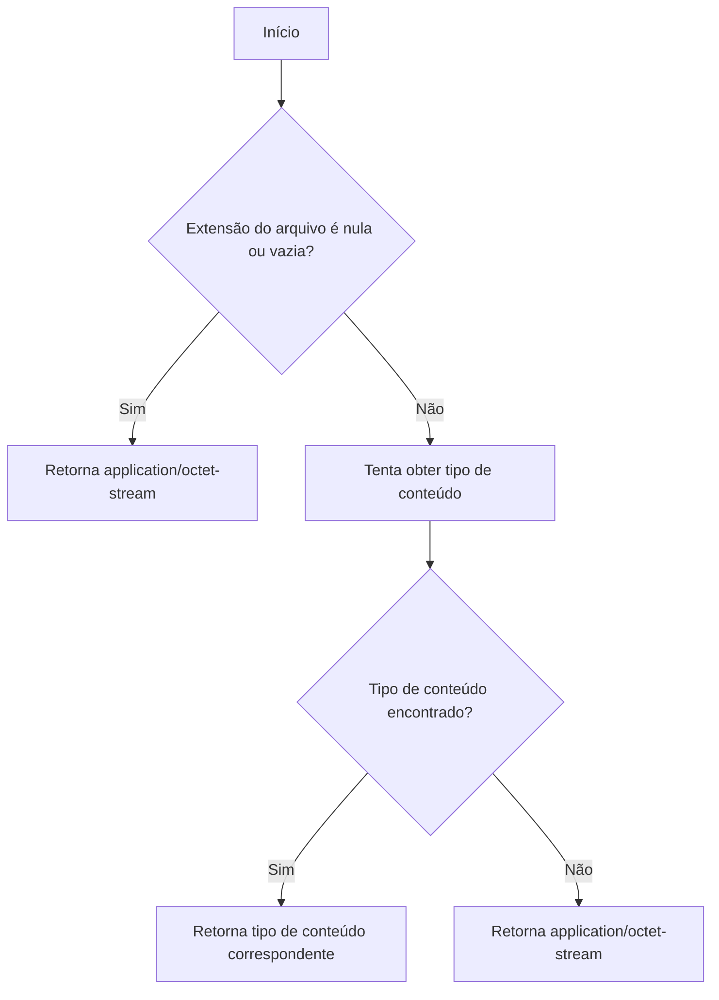
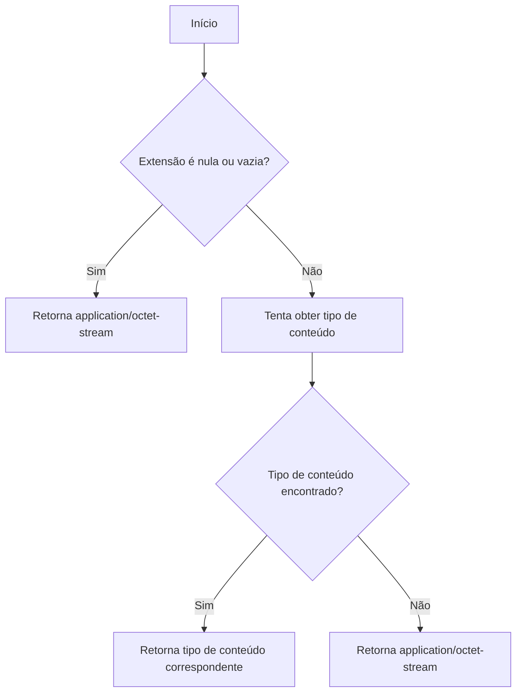
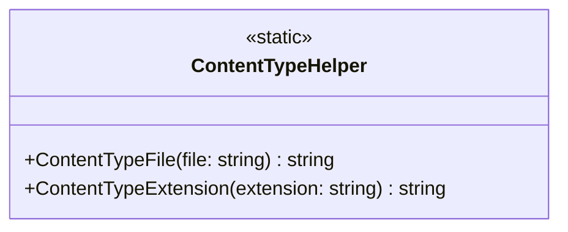

# ContentTypeHelper
**Namespace**: IsthmusWinthor.Dominio  
**Nome do Arquivo**: ContentTypeHelper.cs  

## Visão Geral e Responsabilidade
A classe `ContentTypeHelper` tem como responsabilidade fornecer uma forma de mapear tipos de conteúdo (Content Types) a partir de extensões de arquivo e vice-versa. Essa funcionalidade é crucial em cenários onde o sistema precisa manipular diferentes formatos de arquivos, garantindo que os tipos de conteúdo corretos sejam aplicados em operações de upload, download ou visualização de arquivos. O problema de negócio que esta classe resolve é a necessidade de uma identificação consistente do tipo de dado que cada arquivo representa, melhorando assim a interoperabilidade e o tratamento adequado dos conteúdos.

## Métodos de Negócio

### Título: ContentTypeFile (Estático)
- **Objetivo**: Este método garante que um tipo de conteúdo seja retornado a partir de uma string de nome de arquivo, de modo que o sistema saiba como tratar o arquivo de acordo com sua extensão.
- **Comportamento**: 
  1. O método recebe um nome de arquivo como parâmetro.
  2. A extensão do arquivo é extraída usando o método `Split`.
  3. Verifica se a extensão é nula ou vazia. Se for, retorna o tipo de conteúdo padrão `application/octet-stream`.
  4. Tenta buscar o tipo de conteúdo correspondente à extensão no dicionário `_contentTypes`.
  5. Se a extensão não for encontrada, retorna o tipo de conteúdo padrão.
- **Retorno**: Uma string representando o tipo de conteúdo do arquivo ou o tipo padrão caso não seja possível determinar.

### Título: ContentTypeExtension (Estático)
- **Objetivo**: Garante que o tipo de conteúdo seja retornado a partir de uma extensão de arquivo, facilitando o mapeamento e validação em diversas operações de manipulação de arquivos.
- **Comportamento**: 
  1. O método recebe uma extensão de arquivo como parâmetro.
  2. Verifica se a extensão é nula ou vazia. Se for, retorna o tipo de conteúdo padrão `application/octet-stream`.
  3. Tenta buscar o tipo de conteúdo correspondente à extensão no dicionário `_contentTypes`.
  4. Se a extensão não for encontrada, retorna o tipo de conteúdo padrão.
- **Retorno**: Uma string representando o tipo de conteúdo correspondente à extensão fornecida ou o tipo padrão caso não seja possível determinar.

## Propriedades Calculadas e de Validação
- Esta classe não possui propriedades que contenham lógica em `get` ou validação em `set`.

## Navigation Property
- Esta classe não possui propriedades que sejam classes complexas do domínio.

## Tipos Auxiliares e Dependências
- Não utiliza enumeradores ou classes auxiliares externas além do próprio dicionário privado.

## Diagrama de Relacionamentos

---
Gerada em 29/12/2025 20:01:44
