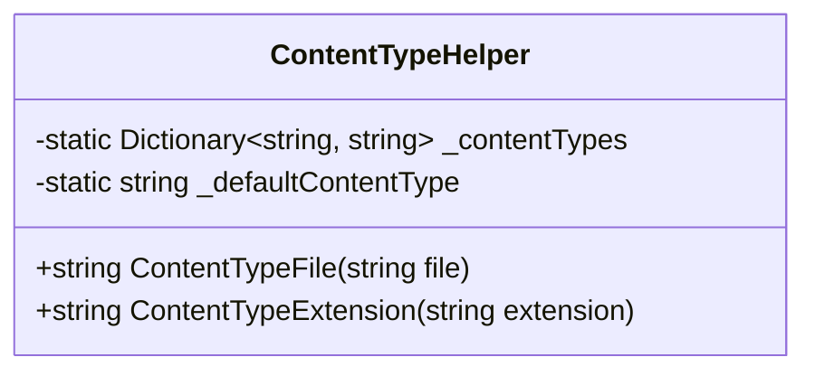

# ContentTypeHelper

**Namespace**: IsthmusWinthor.Dominio  
**Nome do Arquivo**: ContentTypeHelper.cs  

## Visão Geral e Responsabilidade

A classe `ContentTypeHelper` atua como uma ferramenta central para determinar o tipo MIME (Content-Type) de arquivos ou extensões de arquivo dadas. Esta funcionalidade é essencial em cenários em que é necessário identificar e diferenciar tipos de conteúdo para processamento ou transmissão correta de dados através de diferentes meios (ex: web, API). O problema de negócio que ela resolve é garantir que arquivos e extensões sejam mapeados para o tipo MIME correto, uma parte crucial na gestão de tipos de dados em sistemas complexos.

## Métodos de Negócio

### ContentTypeFile(string file)

- **Objetivo**: Identificar o tipo MIME de um arquivo com base na sua extensão.
- **Comportamento**: 
  1. Recebe o nome do arquivo.
  2. Separa a extensão do arquivo usando o último ponto `.` como delimitador.
  3. Verifica se a extensão é nula ou vazia.
     - Se sim, retorna o tipo MIME padrão `application/octet-stream`.
  4. Tenta encontrar no dicionário `_contentTypes` se a extensão está mapeada para um tipo MIME.
  5. Retorna o tipo MIME encontrado ou o padrão `application/octet-stream` se não houver correspondência.
- **Retorno**: Retorna uma `string` que representa o tipo MIME correspondente à extensão do arquivo, ou o tipo padrão se não for encontrado.

   ```mermaid
   flowchart TD
       A[Start] --> B{File Extension Empty?}
       B -->|Yes| C[Return Default: application/octet-stream]
       B -->|No| D{Extension in Dictionary?}
       D -->|Yes| E[Return Corresponding MIME Type]
       D -->|No| C
   ```

### ContentTypeExtension(string extension)

- **Objetivo**: Determinar o tipo MIME com base diretamente na extensão do arquivo.
- **Comportamento**: 
  1. Recebe uma extensão de arquivo como entrada.
  2. Verifica se a extensão é nula ou vazia.
     - Se sim, retorna o tipo MIME padrão `application/octet-stream`.
  3. Tenta localizar a extensão no dicionário `_contentTypes`.
  4. Retorna o tipo MIME correspondente ou o padrão `application/octet-stream` se não encontrado.
- **Retorno**: Retorna uma `string` que representa o tipo MIME correspondente à extensão indicada ou o tipo padrão se a extensão não for reconhecida.

## Tipos Auxiliares e Dependências

- `Dictionary<string, string>`: Estrutura usada para mapear extensões para tipos MIME específicos.

## Diagrama de Relacionamentos



A classe `ContentTypeHelper` não possui referências a outras classes ou enums complexas, atuando de maneira isolada dentro do domínio para fornecer utilidades relacionadas a tipos de conteúdo.
