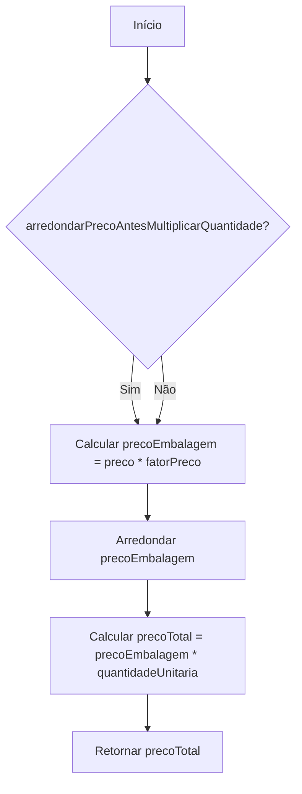
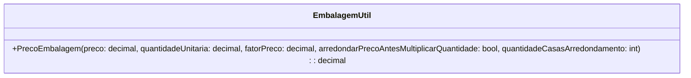

# EmbalagemUtil

**Namespace**: IsthmusWinthor.Dominio  
**Nome do Arquivo**: EmbalagemUtil.cs  

## Visão Geral e Responsabilidade
A classe `EmbalagemUtil` é uma classe de utilidade que fornece métodos estáticos para cálculo de preços relacionados à embalagem de produtos. Ela resolve o problema de negócio de determinar o custo total de embalagem com base no preço unitário, quantidade e fator de preço, garantindo que o valor final possa ser ajustado conforme a necessidade de arredondamento.

## Métodos de Negócio

### Título: PrecoEmbalagem (Público)
- **Objetivo**: Garante o cálculo correto do preço total de embalagem com base no preço unitário do produto, fator de preço aplicável e regras de arredondamento.
- **Comportamento**: 
  1. Calcula o valor base da embalagem multiplicando o preço pelo fator de preço.
  2. Se a opção `arredondarPrecoAntesMultiplicarQuantidade` for verdadeira, o preço é arredondado antes de ser multiplicado pela quantidade.
  3. Multiplica o preço da embalagem (já arredondado, se aplicável) pela quantidade unitária para obter o preço total de embalagem.
- **Retorno**: Retorna o valor decimal que representa o preço total de embalagem.

## Propriedades Calculadas e de Validação
- Não há propriedades calculadas ou de validação específicas na classe `EmbalagemUtil`, pois trata-se de uma classe utilitária que fornece apenas métodos estáticos.

## Navigations Property
- Não há propriedades de navegação na classe, uma vez que se trata de uma classe estática de utilidades.

## Tipos Auxiliares e Dependências
- Não há enumeradores ou classes auxiliares diretamente referenciadas nesta classe.

## Diagrama de Relacionamentos

Esta documentação técnica fornece uma análise detalhada da classe `EmbalagemUtil`, esclarecendo suas responsabilidades e regras de negócio fundamentais, ajudando a obra de software a manter a integridade dos dados e a lógica em seu funcionamento.
---
Gerada em 29/12/2025 20:04:30
