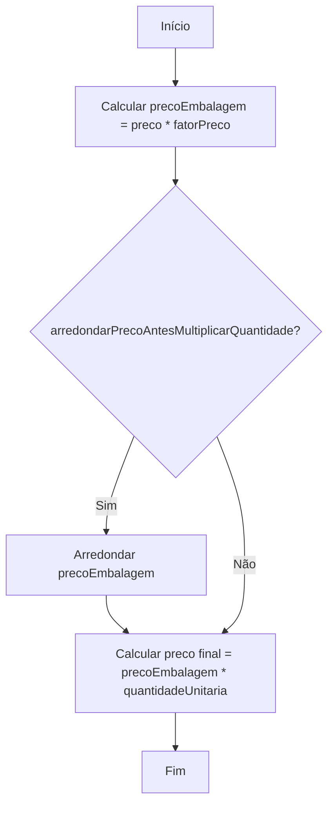

# EmbalagemUtil

**Namespace**: IsthmusWinthor.Dominio  
**Nome do Arquivo**: EmbalagemUtil.cs  

## Visão Geral e Responsabilidade
A classe `EmbalagemUtil` é um componente utilitário dentro da camada de domínio que fornece funcionalidades relacionadas ao cálculo de preço de embalagens. Ela resolve o problema de cálculo de preços modificados por fatores associados a embalagens, incluindo a lógica de arredondamento antes da multiplicação da quantidade, quando necessário. Este utilitário é essencial para garantir a determinação precisa de preços em cenários de venda ou inventário onde são usados múltiplos fatores.

## Métodos de Negócio

### PrecoEmbalagem (public static)
- **Objetivo**: Calcula o preço total da embalagem com base em um preço unitário, um fator multiplicador e uma quantidade, com a opção de arredondar o preço antes de fazer a multiplicação.
- **Comportamento**: 
  1. Calcula o preço base da embalagem multiplicando o preço pelo fator de preço.
  2. Se a variável `arredondarPrecoAntesMultiplicarQuantidade` estiver definida como `true`, o preço é arredondado para o número especificado de casas decimais.
  3. Multiplica o preço da embalagem pela quantidade unitária para obter o preço total.
- **Retorno**: Retorna o valor decimal representando o preço total após todos os cálculos.

- **VISUALIZAÇÃO**:

## Propriedades Calculadas e de Validação
*Não aplicável a esta classe, pois ela não possui propriedades com lógica no get/set.*

## Navigations Property
*Não aplicável à classe estática utilitária `EmbalagemUtil`, pois ela não possui propriedades de navegação.*

## Tipos Auxiliares e Dependências
- **Método de Extensão Utilizado**:  
  - `Arredondar`: Presume-se a existência de uma extensão técnica para arredondamento que não está fornecida no código.  

## Diagrama de Relacionamentos
*Não aplicável, pois a classe `EmbalagemUtil` é uma classe estática utilitária e não possui relações diretas com outras classes de domínio.*

