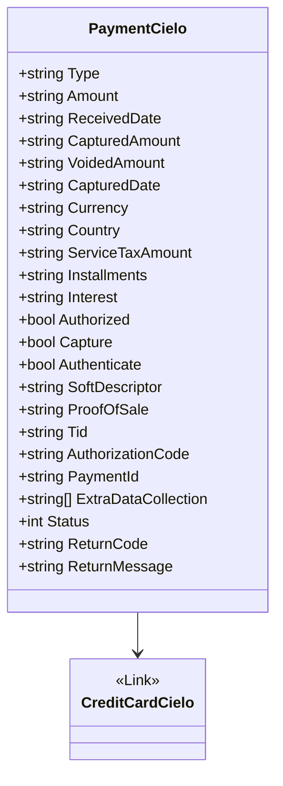

# PaymentCielo
**Namespace**: IsthmusWinthor.Dominio.EntidadeCartao.Cielo  
**Nome do Arquivo**: PaymentCielo.cs  

## Visão Geral e Responsabilidade
A classe `PaymentCielo` representa a estrutura de um pagamento processado pela Cielo, um intermediário de pagamentos. Ela encapsula todos os dados relevantes necessários para a execução e acompanhamento de uma transação, incluindo detalhes sobre o valor, data de recebimento, status, forma de pagamento e informações adicionais. Este modelo é essencial para garantir a integridade e a consistência das operações de pagamento em um sistema corporativo, assegurar que as transações sejam registradas corretamente e facilitar a integração com sistemas contábeis e financeiros.

## Métodos de Negócio
Atualmente, a classe `PaymentCielo` não apresenta métodos com lógica de negócios, uma vez que somente provê encapsulamento para os dados relacionados ao pagamento.

## Propriedades Calculadas e de Validação
- A classe possui propriedades para armazenar informações relevantes sobre o pagamento, mas não contém lógica complexa para cálculo ou validação de valores em suas propriedades. Essas propriedades são principalmente anêmicas e não implementam regras de negócios.

## Navigation Property
- [CreditCardCielo](CreditCardCielo.md): Representa as informações do cartão de crédito utilizado na transação. Essa propriedade é importante para relacionar a transação ao meio de pagamento específico.

## Tipos Auxiliares e Dependências
- Não há enumeradores ou classes estáticas/helper diretamente utilizadas na classe `PaymentCielo`. A dependência destacada é em relação à classe `CreditCardCielo`.

## Diagrama de Relacionamentos

---
Gerada em 29/12/2025 20:11:09
