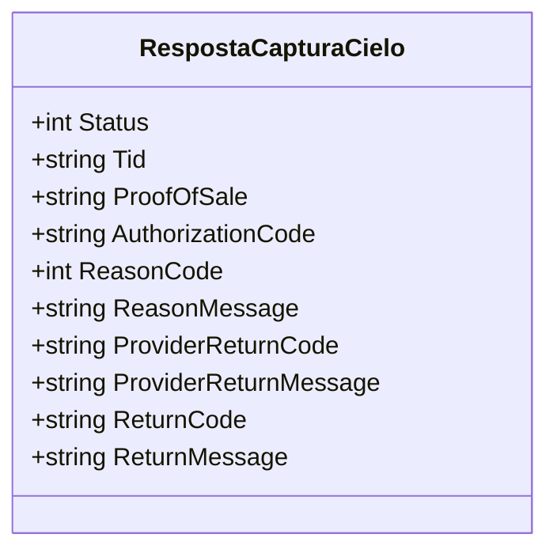

# RespostaCapturaCielo
**Namespace**: IsthmusWinthor.Dominio.EntidadeCartao.Cielo  
**Nome do Arquivo**: RespostaCapturaCielo.cs  

A classe `RespostaCapturaCielo` tem a finalidade de transportar dados relacionados à resposta de captura de transações via Cielo, servindo como estrutura para o retorno de informações pertinentes ao resultado de uma operação de pagamento.

### Método de Negócio
#### Título: (não aplicável, pois a classe não contém métodos com lógica)

### Propriedades Calculadas e de Validação
- **Propriedade**: `Status`
  - **Regra**: O `Status` deve ser validado para indicar o resultado da transação, onde valores específicos representam estados como sucesso ou falha na captura.

### Navigation Property
N/A (a classe não contém propriedades que representam classes complexas do domínio)

### Tipos Auxiliares e Dependências
N/A (a classe não utiliza outros enumeradores ou classes helpers)

### Diagrama de Relacionamentos

---
Gerada em 29/12/2025 20:11:21
