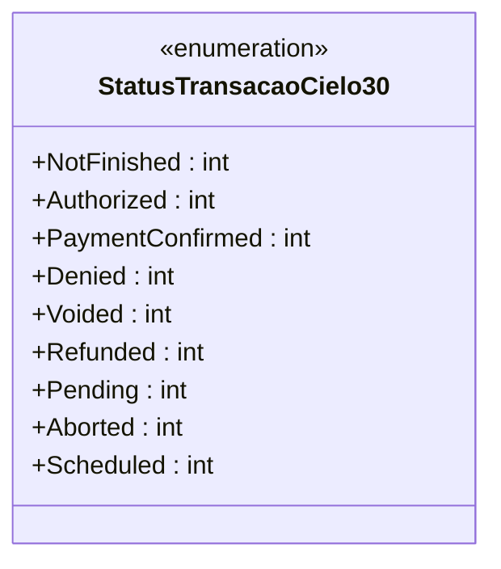

# StatusTransacaoCielo30

**Namespace**: IsthmusWinthor.Dominio.EntidadeCartao.Cielo  
**Nome do Arquivo**: StatusTransacaoCielo30.cs  

Este código define um enumerador que representa os diferentes estados de uma transação no sistema de pagamentos Cielo. Ele facilita a identificação dos vários status que uma transação pode assumir ao longo de seu ciclo de vida.

## Tipos Auxiliares e Dependências
- **Enums**:
  - [StatusTransacaoCielo30](StatusTransacaoCielo30.md)  

---

---
Gerada em 29/12/2025 20:11:29
