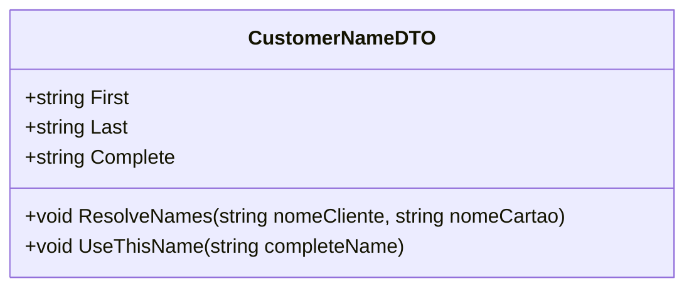

# CustomerNameDTO
**Namespace**: IsthmusWinthor.Dominio.EntidadeCartao  
**Nome do Arquivo**: CustomerNameDTO.cs  

A classe `CustomerNameDTO` é um Data Transfer Object responsável pelo transporte de dados relacionados ao nome do cliente e do cartão. Ela encapsula a lógica necessária para a resolução do nome completo, a partir de dois possíveis dados de entrada: o nome do cliente e o nome do cartão. 

---

### Métodos de Negócio

#### Título: ResolveNames (private)
- **Objetivo**: Este método garante que o nome do cliente ou o nome do cartão sejam adequadamente utilizados para preencher as propriedades `First`, `Last` e `Complete`.
- **Comportamento**: 
  1. Verifica se `nomeCartao` não é nulo ou vazio.
      - Se true, chama `UseThisName` com `nomeCartao`.
  2. Caso contrário, verifica se `nomeCliente` não é nulo ou vazio.
      - Se true, chama `UseThisName` com `nomeCliente`.
  3. Se ambos forem nulos ou vazios, as propriedades permanecem em seus estados iniciais.
- **Retorno**: Não retorna valor, mas altera o estado interno das propriedades `First`, `Last` e `Complete`.

#### Título: UseThisName (private)
- **Objetivo**: Este método é responsável pela atribuição das partes do nome — primeiro e último nomes — conforme o nome completo fornecido.
- **Comportamento**:
  1. Divide o `completeName` usando espaço como delimitador.
  2. Atribui o primeiro elemento do array resultante à propriedade `First`.
  3. Atribui o último elemento do array resultante à propriedade `Last`.
  4. Atribui o `completeName` à propriedade `Complete`.
- **Retorno**: Não retorna valor, mas alimenta as propriedades com valores extraídos do nome completo.

---

### Propriedades Calculadas e de Validação
- `First`: Esta propriedade retorna o primeiro nome do cliente, que é extraído a partir do nome completo fornecido. A regra que a rege é que o primeiro nome é sempre o primeiro elemento da string, dividida por espaços.
- `Last`: Esta propriedade retorna o último nome do cliente, sendo o último elemento da string, dividida por espaços.
- `Complete`: Esta propriedade contém o nome completo que foi utilizado na resolução.

### Navigations Property
Não existem navigations properties complexas nesta classe.

### Tipos Auxiliares e Dependências
Nenhum enumerador ou classe estática é utilizado dentro desta classe.

### Diagrama de Relacionamentos

---
Gerada em 29/12/2025 20:10:45
