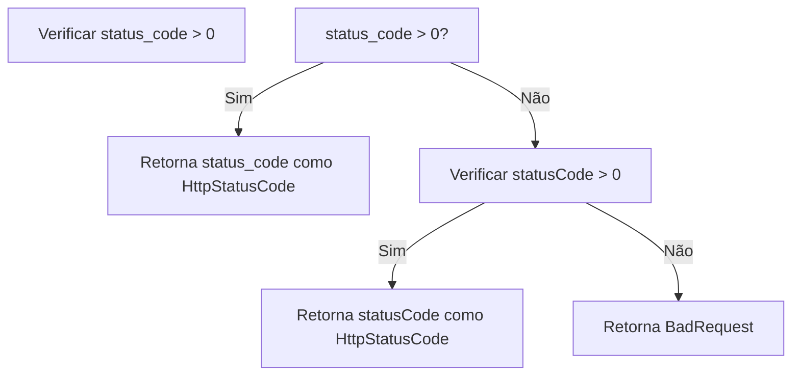
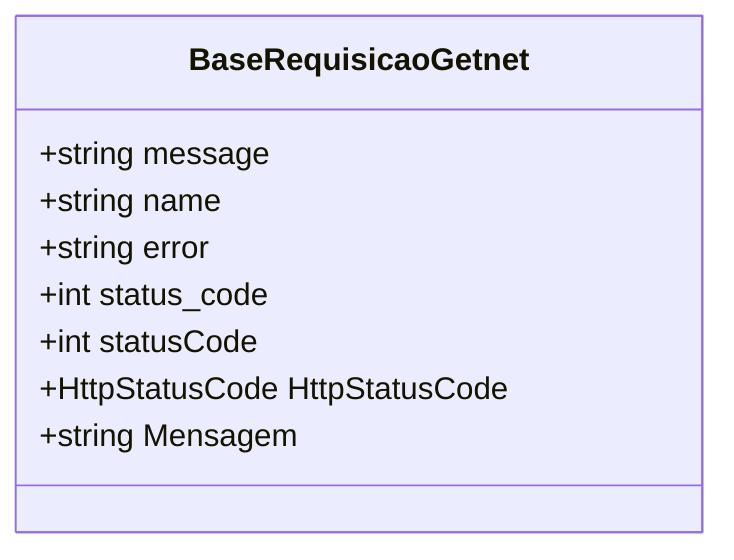

# BaseRequisicaoGetnet
**Namespace**: IsthmusWinthor.Dominio.EntidadeCartao.Getnet  
**Nome do Arquivo**: BaseRequisicaoGetnet.cs  

## Visão Geral e Responsabilidade
A classe `BaseRequisicaoGetnet` atua como um container para as respostas de transações de pagamento, encapsulando mensagens de erro retornadas pela API de pagamento Getnet. Seu papel é interpretar essas mensagens e fornecer informações mais claras e contextualizadas para o usuário final ou sistema. Ela resolve o problema de comunicação em casos de falhas de transação, oferecendo respostas informativas que ajudam na identificação do que deu errado.

## Métodos de Negócio

### Método: `HttpStatusCode` (Visibilidade: Pública)
- **Objetivo**: Determinar o código de status HTTP correspondente à resposta da transação, com base em determinados campos da classe. Este método garante que a classe apresente um correto estado de sucesso ou erro da transação.
- **Comportamento**: 
  1. Verifica se `status_code` é maior que zero. Se sim, retorna o valor correspondente como um `HttpStatusCode`.
  2. Se `status_code` não for válido, verifica `statusCode` e, se válido, retorna também como `HttpStatusCode`.
  3. Se ambos forem inválidos, retorna `HttpStatusCode.BadRequest`.
- **Retorno**: Um valor do tipo `HttpStatusCode`, representando o resultado da operação.

### Método: `Mensagem` (Visibilidade: Pública)
- **Objetivo**: Construir uma mensagem amigável e informativa sobre a falha da transação, dependendo do código de erro ou nome do erro. Garante que o usuário receba orientações sobre como proceder em caso de erro.
- **Comportamento**: 
  1. Verifica se a mensagem retornada é "DENY". Se sim, fornece uma mensagem padrão com conselhos sobre possíveis causas.
  2. Se a mensagem for diferente, tenta determinar uma mensagem concatenada através do nome do erro utilizando o método `MensagemByName`.
  3. Caso não haja mensagem, nome ou erro, retorna uma mensagem padrão.
- **Retorno**: Uma string representando a mensagem a ser apresentada ao usuário, que pode incluir orientações ou uma descrição do erro.

### Método: `MensagemByName` (Visibilidade: Privada)
- **Objetivo**: Fornecer uma mensagem descritiva com base no nome do erro específico recebido. Isso ajuda a mapear códigos de erro em mensagens específicas que ajudam na identificação do problema.
- **Comportamento**: 
  1. Recebe um nome de erro e verifica se é nulo ou vazio, retornando a mensagem padrão se for.
  2. Compara o nome com vários casos (ex: "InvalidNumberIntallmentsError", "ValidationError", entre outros) e retorna a mensagem apropriada para cada um.
  3. Se o nome não corresponder a nenhum caso conhecido, retorna uma mensagem padrão.
- **Retorno**: Uma string que representa a mensagem de erro associada ao nome fornecido.

## Propriedades Calculadas e de Validação

### Propriedade: `HttpStatusCode` (visibilidade: Pública)
- **Regra**: Essa propriedade calcula o código de status HTTP que deve ser retornado, considerando os campos `status_code` e `statusCode`. Ela garante que, se ambos não forem válidos, seja retornado um erro genérico (`BadRequest`).

### Propriedade: `Mensagem` (visibilidade: Pública)
- **Regra**: Esta propriedade tem lógica em seu getter, que determina e formatam mensagens de erro com base nas informações disponíveis. Isso garante que o usuário sempre veja uma mensagem relevante e contextualizada em caso de falha de transação.

## Navigations Property
N/A

## Tipos Auxiliares e Dependências
- Enum: [HttpStatusCode](https://learn.microsoft.com/en-us/dotnet/api/system.net.httpstatuscode)

## Diagrama de Relacionamentos

---
Gerada em 29/12/2025 20:11:54
