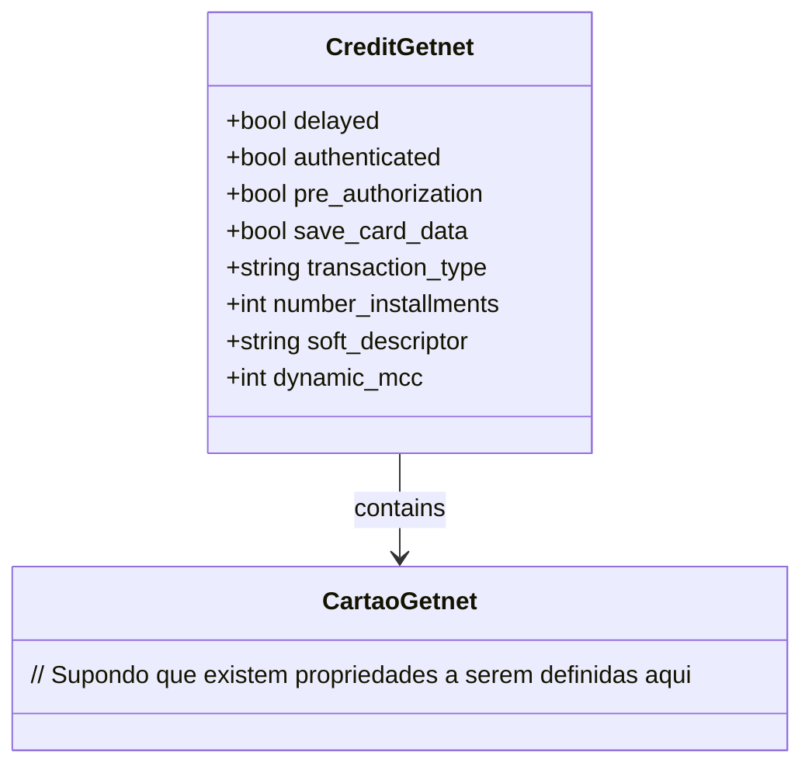

# CreditGetnet
**Namespace**: IsthmusWinthor.Dominio.EntidadeCartao.Getnet  
**Nome do Arquivo**: CreditGetnet.cs  

## Visão Geral e Responsabilidade
A classe `CreditGetnet` é um modelo de domínio que representa as configurações e detalhes de uma transação de crédito utilizando a plataforma Getnet. Essa classe encapsula informações essenciais que garantem a integridade e a validação do processo de pagamento, assegurando que as opções de pagamento sejam configuradas corretamente de acordo com as regras comerciais especificadas.

## Métodos de Negócio
A classe `CreditGetnet` não possui métodos com lógica de negócios definida, focando apenas em propriedades simulando o estado da transação. Assim, não há necessidade de detalhar métodos neste ponto.

## Propriedades Calculadas e de Validação
Uma análise das propriedades da classe `CreditGetnet` revela que não existem propriedades que realizem cálculos ou validações.

## Navigation Property
- `card`: [CartaoGetnet](CartaoGetnet.md) - Representa a entidade do cartão, que é uma classe complexa associada a esta transação de crédito.

## Tipos Auxiliares e Dependências
- Esta classe não possui enumeradores ou classes estáticas/helpers associadas diretamente a ela.

## Diagrama de Relacionamentos

---
Gerada em 29/12/2025 20:12:09
