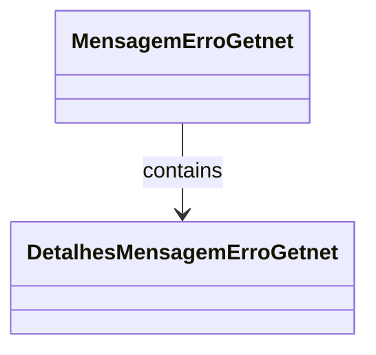

# MensagemErroGetnet
**Namespace**: IsthmusWinthor.Dominio.EntidadeCartao.Getnet  
**Nome do Arquivo**: MensagemErroGetnet.cs  

## Visão Geral e Responsabilidade
A classe `MensagemErroGetnet` representa a estrutura de erro retornada pela API do Getnet. Ela encapsula informações essenciais sobre o erro, como a mensagem, o código de status e detalhes adicionais, permitindo que o sistema trate e exiba erros de forma adequada ao usuário final. Sua funcionalidade é crucial para garantir a robustez e a experiência do usuário em caso de falhas na comunicação com a API.

## Métodos de Negócio
Esta classe não contém métodos com lógica de negócio, sendo composta apenas por propriedades que transportam dados.

## Propriedades Calculadas e de Validação
Não há propriedades que contenham lógica de cálculo ou validação.

## Navigations Property
- `details`: É uma lista de objetos do tipo [DetalhesMensagemErroGetnet](DetalhesMensagemErroGetnet.md), que contém informações detalhadas sobre o erro que ocorreu.

## Tipos Auxiliares e Dependências
- [DetalhesMensagemErroGetnet](DetalhesMensagemErroGetnet.md)

## Diagrama de Relacionamentos

---
Gerada em 29/12/2025 20:12:20
