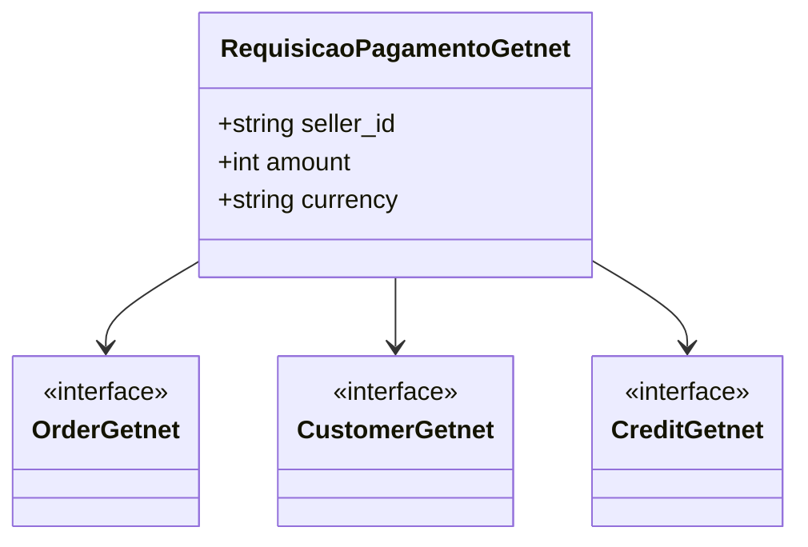

# RequisicaoPagamentoGetnet
- **Namespace**: IsthmusWinthor.Dominio.EntidadeCartao.Getnet
- **Nome do Arquivo**: RequisicaoPagamentoGetnet.cs

A classe `RequisicaoPagamentoGetnet` é responsável por consolidar todas as informações necessárias para a realização de um pagamento utilizando a plataforma Getnet. Ela serve como um modelo de dados que transporta informações entre os sistemas de frontend e backend, facilitando a integração com os serviços de pagamento.

## Métodos de Negócio
Nenhum método de lógica com condições complexas está presente nesta classe, apenas propriedades.

## Propriedades Calculadas e de Validação
- **currency**: 
  - Lógica: O valor retorna sempre "BRL", representando a moeda brasileira. Não há validação na propriedade, pois o retorno é fixo.

## Navegação Property
- **Order**: [OrderGetnet](OrderGetnet.md)
- **Customer**: [CustomerGetnet](CustomerGetnet.md)
- **Credit**: [CreditGetnet](CreditGetnet.md)

## Tipos Auxiliares e Dependências
- [OrderGetnet](OrderGetnet.md)
- [CustomerGetnet](CustomerGetnet.md)
- [CreditGetnet](CreditGetnet.md)

## Diagrama de Relacionamentos

---
Gerada em 29/12/2025 20:12:35
