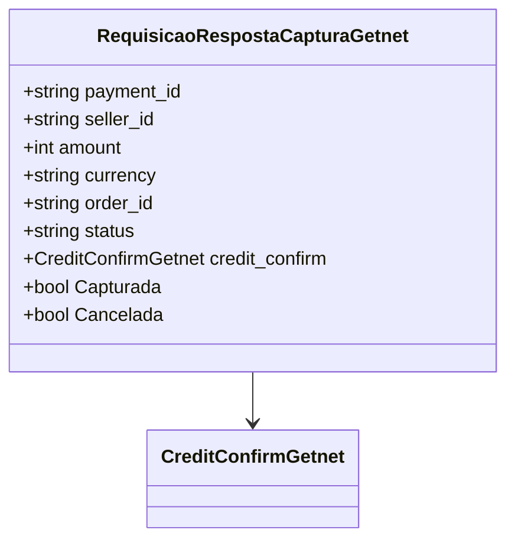

# RequisicaoRespostaCapturaGetnet
**Namespace**: IsthmusWinthor.Dominio.EntidadeCartao.Getnet  
**Nome do Arquivo**: RequisicaoRespostaCapturaGetnet.cs  

## Visão Geral e Responsabilidade
A classe `RequisicaoRespostaCapturaGetnet` representa o modelo de resposta de uma captura de pagamento ao sistema Getnet. Sua responsabilidade é encapsular os dados retornados após efetuar uma requisição de captura, garantindo que informações como status do pagamento, montante, e detalhes de confirmação de crédito sejam acessíveis de maneira padronizada. Ela resolve o problema de negócio de validar e gerenciar estados de transações de pagamento, essencial para o fluxo financeiro da aplicação.

## Métodos de Negócio
### Título: Capturada (Propriedade)
- **Objetivo**: Garantir que a verificação de um pagamento capturado seja realizada corretamente, baseando-se no status da transação.
- **Comportamento**: 
  1. A propriedade `Capturada` é acessada.
  2. O status da transação é comparado com a string "CONFIRMED", utilizando uma comparação que ignora maiúsculas e minúsculas.
  3. Retorna `true` se o status for "CONFIRMED", caso contrário, retorna `false`.
- **Retorno**: Retorna um valor booleano indicando se o pagamento foi capturado com sucesso.

### Título: Cancelada (Propriedade)
- **Objetivo**: Garantir que a verificação de um pagamento cancelado seja realizada corretamente, considerando o status da transação.
- **Comportamento**: 
  1. A propriedade `Cancelada` é acessada.
  2. O status da transação é comparado com a string "CANCELED", utilizando uma comparação que ignora maiúsculas e minúsculas.
  3. Retorna `true` se o status for "CANCELED", caso contrário, retorna `false`.
- **Retorno**: Retorna um valor booleano indicando se o pagamento foi cancelado.

## Propriedades Calculadas e de Validação
- `Capturada`: Validando o estado do pagamento com base na comparação do `status`.
- `Cancelada`: Validando o estado do pagamento com a mesma lógica conforme `Capturada`.

## Navigations Property
- `credit_confirm`: [CreditConfirmGetnet](CreditConfirmGetnet.md)

## Tipos Auxiliares e Dependências
- `CreditConfirmGetnet`: [CreditConfirmGetnet](CreditConfirmGetnet.md)

## Diagrama de Relacionamentos

---
Gerada em 29/12/2025 20:12:51
