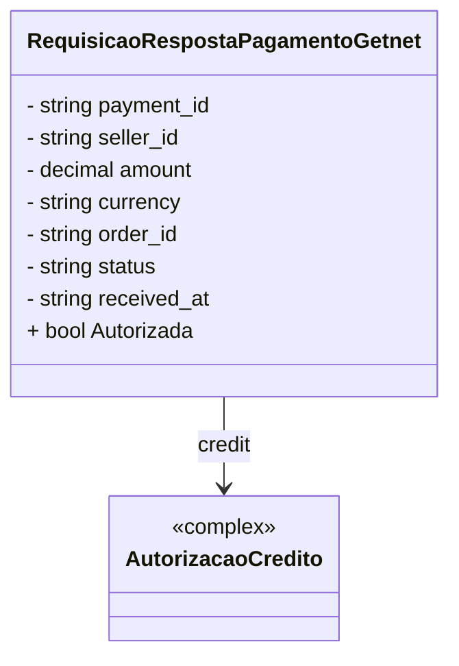

# RequisicaoRespostaPagamentoGetnet
**Namespace**: IsthmusWinthor.Dominio.EntidadeCartao.Getnet  
**Nome do Arquivo**: RequisicaoRespostaPagamentoGetnet.cs  

## Visão Geral e Responsabilidade
A classe `RequisicaoRespostaPagamentoGetnet` representa a resposta de uma requisição de pagamento processada pelo sistema de pagamentos Getnet. O objetivo principal é encapsular todos os dados retornados após uma transação de pagamento, como identificadores, valores e status. Essa classe assegura que as informações de pagamento recebidas sejam interpretadas corretamente, facilitando a tomada de decisões em relação à confirmação ou rejeição de uma transação.

## Métodos de Negócio
### Título: Autorizada (get)
- **Objetivo**: Determina se o pagamento foi aprovado com base no status da transação.
- **Comportamento**: 
  1. O método verifica o valor da propriedade `status`.
  2. Se o `status` é igual a "APPROVED" ou "AUTHORIZED" (caso insensível), retorna `true`, indicando que o pagamento foi autorizado.
  3. Caso contrário, retorna `false`, indicando que o pagamento não foi autorizado.
- **Retorno**: `true` se o pagamento foi autorizado, `false` caso contrário.

### Visualização
```mermaid
flowchart TD
    A[Verificar status] -->|status == "APPROVED"| B[Retorna true]
    A -->|status == "AUTHORIZED"| B
    A -->|outro| C[Retorna false]
```

## Propriedades Calculadas e de Validação
- **Autorizada**: A propriedade `Autorizada` tem lógica que determina se o pagamento foi efetivamente autorizado. É importante para garantir que somente transações bem-sucedidas sejam consideradas para processamento posterior.

## Navigations Property
- **credit**: Composição da classe `AutorizacaoCredito`. Presume-se um arquivo chamado [AutorizacaoCredito](AutorizacaoCredito.md) que define essa classe.

## Tipos Auxiliares e Dependências
- **Enums**: Nenhum enumerador é utilizado diretamente nesta classe.
- Classes Estáticas/Helpers: Nenhuma classe auxiliar foi referenciada diretamente.

## Diagrama de Relacionamentos

---
Gerada em 29/12/2025 20:13:04
