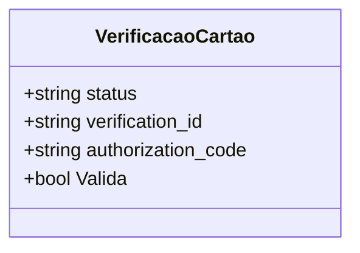

# VerificacaoCartao

**Namespace**: IsthmusWinthor.Dominio.EntidadeCartao.Getnet  
**Nome do Arquivo**: VerificacaoCartao.cs  

## Visão Geral e Responsabilidade
A classe `VerificacaoCartao` é responsável por encapsular as informações e a validação do status de verificação de cartões em um fluxo de transações financeiras. Ela tem como objetivo principal verificar se a resposta da verificação do cartão é "VERIFIED", garantindo a integridade e a conformidade do processo de pagamento do usuário.

## Métodos de Negócio
### Título: **Valida** (Público)
- **Objetivo**: Assegura que o status da verificação do cartão é "VERIFIED", indicando que o cartão foi autenticado com sucesso.
- **Comportamento**: 
  1. O método acessa a propriedade `status`.
  2. Compara seu valor com a string "VERIFIED", ignorando maiúsculas e minúsculas.
  3. Retorna `true` se o status for igual a "VERIFIED" e `false` caso contrário.
- **Retorno**: Retorna `true` se a verificação for bem-sucedida, sinalizando que o cartão está validado para continuar o processo de pagamento.

```mermaid
flowchart TD
    A[Inicio] --> B{status == "VERIFIED"}
    B -- Sim --> C[Retorna true]
    B -- Não --> D[Retorna false]
```

## Propriedades Calculadas e de Validação
- **Valida**: Esta propriedade calcula sua saída com base no valor da propriedade `status`, garantindo que o cartão seja considerado validado apenas quando seu status for "VERIFIED".

## Navigations Property
- Esta classe não contém propriedades que sejam classes complexas do domínio.

## Tipos Auxiliares e Dependências
- Nenhum tipo auxiliar ou dependência externa é utilizado nesta classe.

## Diagrama de Relacionamentos


---
Gerada em 29/12/2025 20:13:21
