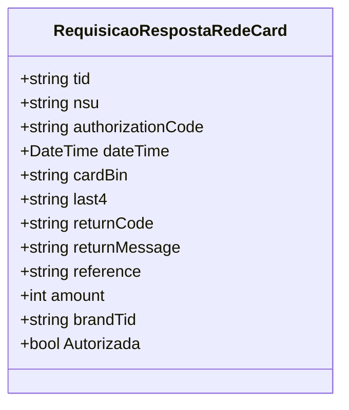

# RequisicaoRespostaRedeCard
**Namespace**: IsthmusWinthor.Dominio.EntidadeCartao.RedeCard  
**Nome do Arquivo**: RequisicaoRespostaRedeCard.cs  

## Visão Geral e Responsabilidade
A classe `RequisicaoRespostaRedeCard` representa a estrutura de dados que contém as informações de resposta de uma requisição de cartão realizada através do sistema RedeCard. Essa classe é responsável por encapsular os dados relevantes que são retornados após uma transação, permitindo que o sistema valide e processe adequadamente as respostas recebidas de forma eficaz.

## Métodos de Negócio
### Autorizada: Propriedade pública
- **Objetivo**: Indica se a autorização da transação foi bem-sucedida.
- **Comportamento**: A propriedade `Autorizada` é definida pelo estado da autorização da transação. Ela é uma representação direta do sucesso ou falha da autorização com base nos detalhes fornecidos na resposta, como `returnCode` e `returnMessage`.
- **Retorno**: Retorna um valor booleano (`true` ou `false`), onde `true` indica que a transação foi autorizada com sucesso e `false` indica uma falha na autorização.

## Propriedades Calculadas e de Validação
A classe não possui propriedades calculadas com lógica no `get` ou validação no `set`, pois todos os atributos são anêmicos e refletem diretamente os dados recebidos.

## Navigation Properties
Não há propriedades que são classes complexas do domínio nesta classe. Todas as propriedades são de tipos simples, como `string`, `int` e `DateTime`.

## Tipos Auxiliares e Dependências
Esta classe não possui dependências a Enumeradores (Enums) ou Classes Estáticas/Helpers que sejam necessários para seu funcionamento.

## Diagrama de Relacionamentos

Esta documentação fornece uma visão clara sobre a classe `RequisicaoRespostaRedeCard`, detalhando suas responsabilidades, métodos, propriedades e sua estrutura, ajudando na manutenção e compreensão do sistema em que está inserida.
---
Gerada em 29/12/2025 20:13:38
