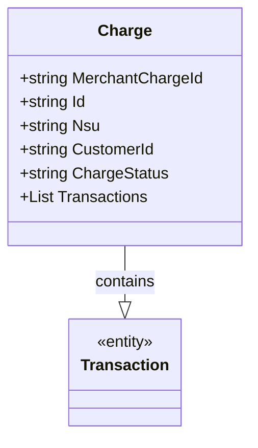

# Charge
**Namespace**: IsthmusWinthor.Dominio.EntidadeCartao.SafraPay.Cancelamentos.Response  
**Nome do Arquivo**: Charge.cs  

Charge é uma classe que serve como um Data Transfer Object (DTO) para transportar informações sobre um cancelamento de cobrança no sistema de pagamentos SafraPay.

---

### Métodos de Negócio
Não há métodos com lógica no domínio a serem documentados nesta classe, pois a mesma é composta apenas de propriedades anêmicas.

### Propriedades Calculadas e de Validação
Não existem propriedades com lógica de cálculo ou validação nesta classe, uma vez que todas as propriedades são simples tipos de dados.

### Navigations Property
- `Transactions`: List<Transaction> - Representa uma lista de transações relacionadas à charge.

### Tipos Auxiliares e Dependências
- [Transaction](Transaction.md): Classe que contém detalhes de cada transação associada à cobrança.

### Diagrama de Relacionamentos

---
Gerada em 29/12/2025 20:13:59
