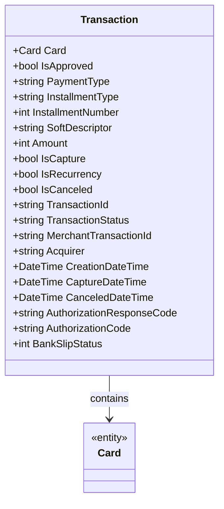

# Transaction
**Namespace**: IsthmusWinthor.Dominio.EntidadeCartao.SafraPay.Cancelamentos.Response  
**Nome do Arquivo**: Transaction.cs  

## Visão Geral e Responsabilidade
A classe `Transaction` representa uma transação financeira em um sistema de pagamento, encapsulando tanto as informações do cartão utilizado quanto os detalhes do pagamento. Sua responsabilidade é garantir a integridade e a consistência dos dados referentes a uma transação, além de prover informações que são essenciais para a aprovação, captura, cancelamento e análise do histórico de cada transação em um contexto de pagamentos.

## Métodos de Negócio
(Nota: A classe `Transaction` não contém métodos de lógica de negócio além dos simples getters e setters, portanto não há métodos a serem documentados neste caso.)

## Propriedades Calculadas e de Validação
- **IsApproved**: Esta propriedade indica se a transação foi aprovada. A regra associada é que uma transação só pode ser considerada aprovada quando certas condições, como a validação do cartão e a confirmação do pagamento pelo provedor, são atendidas.

## Navigations Property
- [Card](Card.md): Representa a classe que contém informações detalhadas sobre o cartão utilizado na transação.

## Tipos Auxiliares e Dependências
- (Não há tipos auxiliares ou enumeradores associados a esta classe.)

## Diagrama de Relacionamentos

---
Gerada em 29/12/2025 20:14:08
