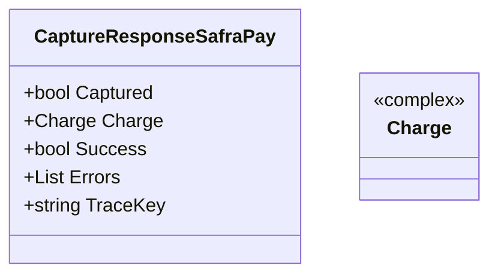

# CaptureResponseSafraPay
**Namespace**: IsthmusWinthor.Dominio.EntidadeCartao.SafraPay.Captura.Response  
**Nome do Arquivo**: CaptureResponseSafraPay.cs  

### Citação
A classe `CaptureResponseSafraPay` é um DTO que transporta dados referentes à resposta da captura de pagamentos no sistema SafraPay. 

---

### Diagrama de Relacionamentos

Neste caso, a classe `CaptureResponseSafraPay` atua como um modelo de transferência de dados (DTO) e não contém lógica de negócios ou estrutura complexa que necessite de uma documentação detalhada das regras envolvidas. As informações apresentadas refletem sua função como um transportador de dados na interação com a API de captura de pagamentos.
---
Gerada em 29/12/2025 20:14:15
