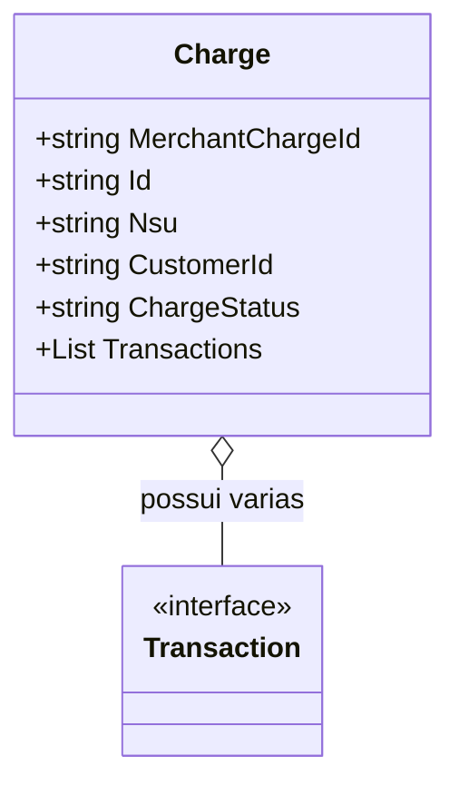

# Charge
**Namespace**: IsthmusWinthor.Dominio.EntidadeCartao.SafraPay.Captura.Response  
**Nome do Arquivo**: Charge.cs  

A classe **Charge** serve como um modelo de transporte de dados para capturar informações relacionadas a uma cobrança realizada, incluindo detalhes sobre o comerciante, status da cobrança e as transações associadas. 

## Métodos de Negócio
A classe **Charge** não contém métodos com lógica de negócio, apenas propriedades para transporte de dados.

## Propriedades Calculadas e de Validação
A classe **Charge** não apresenta propriedades que possuam lógica no `get` ou validação no `set`.

## Navigations Property
- **Transactions**: List<Transaction> — Representa uma coleção de transações associadas a esta cobrança, onde **Transaction** é uma classe que deve ser documentada separadamente. [Transaction](Transaction.md)

## Tipos Auxiliares e Dependências
No contexto da classe **Charge**, não há enumeradores ou classes estáticas/auxiliares mencionadas que sejam utilizadas.

## Diagrama de Relacionamentos

---
Gerada em 29/12/2025 20:14:24
