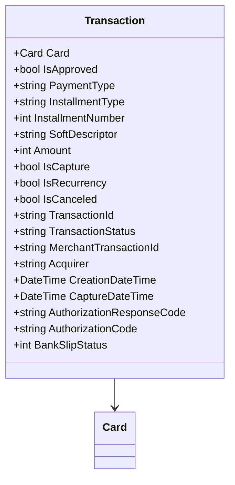

# Transaction
**Namespace**: IsthmusWinthor.Dominio.EntidadeCartao.SafraPay.Captura.Response  
**Nome do Arquivo**: Transaction.cs  

## Visão Geral e Responsabilidade
A classe `Transaction` atua como um modelo de domínio que representa uma transação financeira vinculada a um cartão. Sua principal responsabilidade é encapsular os dados e comportamentos associados a uma transação de pagamento, incluindo a validação e processamento de informações essenciais sobre o pagamento, seu estado e características, conforme necessário para o sistema de captura de pagamentos.

## Métodos de Negócio
Atualmente, a classe `Transaction` contém apenas propriedades simples sem métodos com lógica complexa, portanto não há métodos de negócio a serem detalhados.

## Propriedades Calculadas e de Validação
- Nenhuma propriedade possui lógica no `get` ou validação no `set`.

## Navigation Property
- [Card](Card.md): Representa as informações do cartão utilizadas na transação.

## Tipos Auxiliares e Dependências
- Não há enumeradores (Enums) ou classes estáticas/helpers referenciadas nesta classe.

## Diagrama de Relacionamentos

---
Gerada em 29/12/2025 20:14:33
