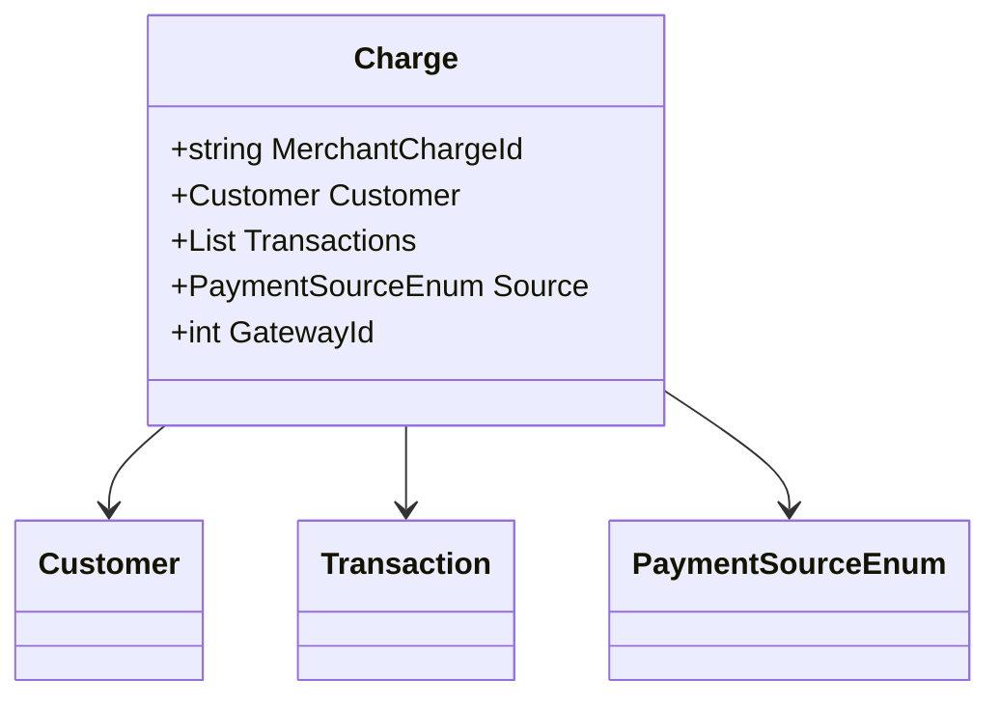

# Charge
**Namespace**: IsthmusWinthor.Dominio.EntidadeCartao.SafraPay.Pagamentos.Request  
**Nome do Arquivo**: Charge.cs  

## Visão Geral e Responsabilidade
A classe `Charge` representa uma solicitação de cobrança no sistema de pagamentos, encapsulando as informações necessárias para processar uma transação financeira. Ela atua como um objeto que transporta os dados essenciais para a realização de pagamentos, incluindo a identificação do comerciante, informações do cliente, a lista de transações a serem realizadas, a fonte de pagamento e o identificador do gateway. Essa classe é crucial para garantir que todas as informações necessárias para a execução de um pagamento sejam fornecidas de forma consistente e segura.

## Métodos de Negócio
- **Título**: Não há métodos com lógica direta nesta classe.

## Propriedades Calculadas e de Validação
- Não há propriedades com lógica de validação ou cálculo nesta classe.

## Navigation Properties
- [Customer](Customer.md) - Representa o cliente associado à cobrança.
- [Transaction](Transaction.md) - Representa uma transação específica no contexto da cobrança.

## Tipos Auxiliares e Dependências
- [PaymentSourceEnum](PaymentSourceEnum.md) - Enum que representa as possíveis fontes de pagamento associadas a uma cobrança.

## Diagrama de Relacionamentos

---
Gerada em 29/12/2025 20:14:46
