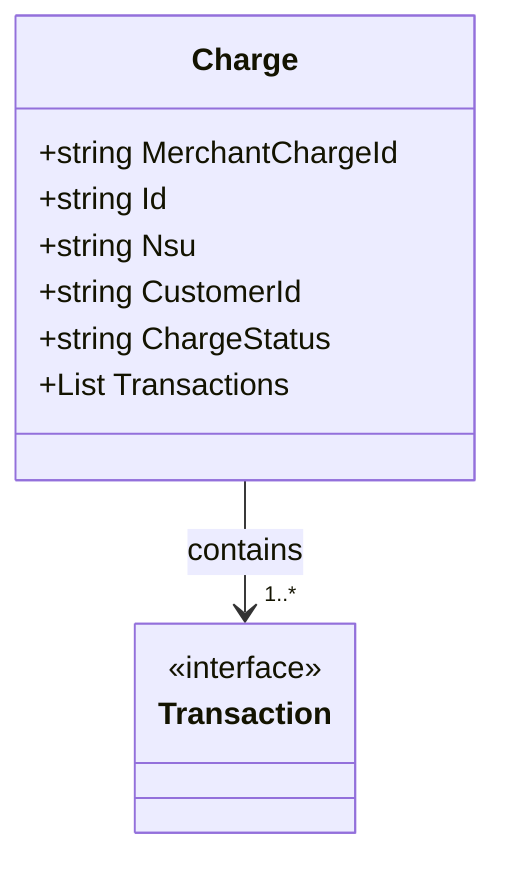

# Charge
**Namespace**: IsthmusWinthor.Dominio.EntidadeCartao.SafraPay.Pagamentos.Response  
**Nome do Arquivo**: Charge.cs

## Visão Geral e Responsabilidade
A classe `Charge` atua como um modelo de transporte de dados que encapsula informações relacionadas a uma cobrança comercial dentro do sistema de pagamentos SafraPay. O objetivo principal desta classe é reunir todos os dados relevantes de uma transação de cobrança, incluindo identificação do comerciante, status da cobrança e detalhes das transações associadas, permitindo uma representação consistente e estruturada das informações financeiras.

## Métodos de Negócio
A classe `Charge` contém apenas propriedades anêmicas, não implementando métodos que encapsulam lógica de negócios. Portanto, não há métodos de negócio a serem documentados nesta classe.

## Propriedades Calculadas e de Validação
A classe `Charge` não possui propriedades com lógica complexa no `get` ou validação no `set`. Todas as propriedades são simples e do tipo anêmico.

## Navigations Property
- `Transactions` - Lista de transações relacionadas que pode ser mapeada como uma coleção de [Transaction](Transaction.md).

## Tipos Auxiliares e Dependências
A classe `Charge` depende do seguinte tipo auxiliar:
- `Transaction` - Representa detalhes de uma transação individual dentro da cobrança.

## Diagrama de Relacionamentos

Este diagrama representa a classe `Charge` e mostra sua relação com a classe `Transaction`, indicando que uma `Charge` pode conter várias transações.
---
Gerada em 29/12/2025 20:15:16
