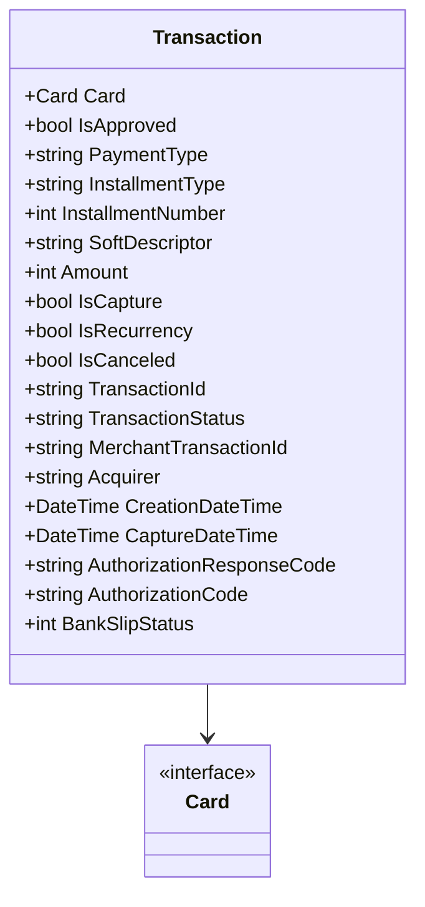

# Transaction
**Namespace**: IsthmusWinthor.Dominio.EntidadeCartao.SafraPay.Pagamentos.Response  
**Nome do Arquivo**: Transaction.cs

## Visão Geral e Responsabilidade
A classe `Transaction` representa uma transação financeira envolvendo um cartão e encapsula todas as informações necessárias para processar pagamentos. Este modelo de domínio fornece uma estrutura para monitorar o estado da transação, incluindo a aprovação, detalhes de pagamento, e status específico da transação, garantindo que as informações de pagamento sejam rigorosamente geridas e auditáveis.

## Métodos de Negócio
A classe `Transaction` é composta principalmente de propriedades e não contém métodos com lógica de negócios complexa. Portanto, este segmento não se aplica.

## Propriedades Calculadas e de Validação
A classe `Transaction` não possui propriedades que realizem cálculos complexos ou validações diretas em seus getters/setters.

## Navigations Property
- `Card`: [Card](Card.md) - Representa informações detalhadas sobre o cartão utilizado na transação.

## Tipos Auxiliares e Dependências
Não há enumeradores ou classes estáticas/helpers diretamente associados a esta classe.

## Diagrama de Relacionamentos

---
Gerada em 29/12/2025 20:15:22
